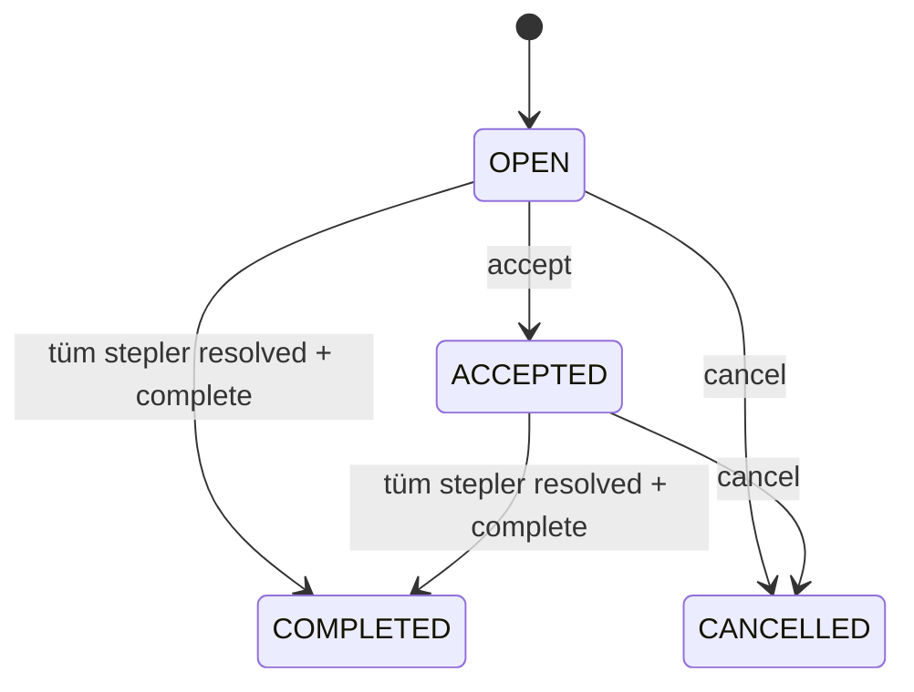
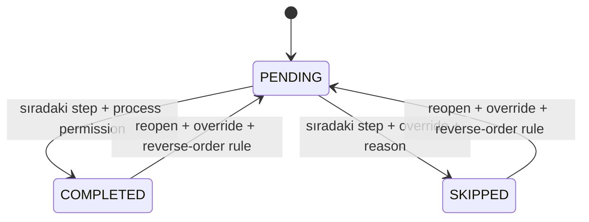
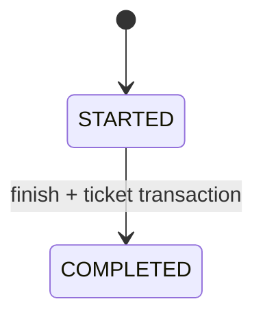
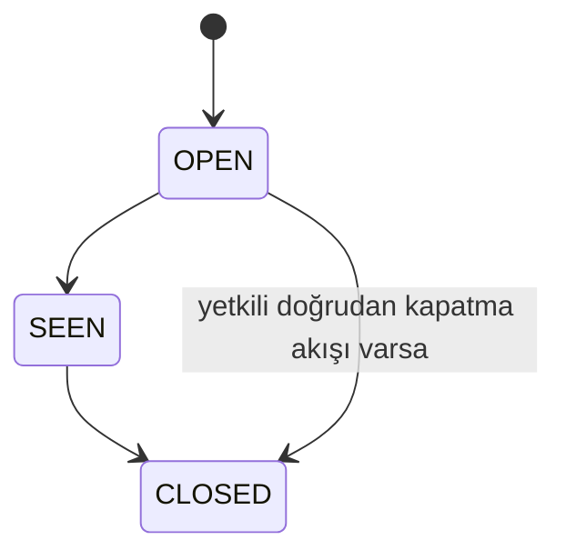
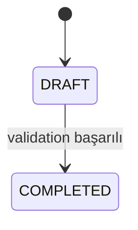
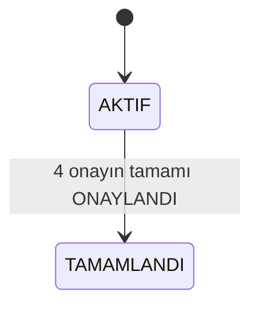

# A Blok Kalite Kontrol — DOMAIN RULES v1

**Tarih:** 26.08.2026  
**Üst doküman:** `WEB_DONUSUM_MASTER_PLANI_V1.md`  
**Kaynak:** VB.NET WinForms kaynak kodu, `DataService.vb`, `AppState.vb`, form sınıfları, servisler, `YETKI_MATRISI.md` ve uygulama içi notlar.  
**Amaç:** Web dönüşümünde korunacak iş kurallarını, legacy davranışları ve bilinçli tasarım değişikliklerini Codex/uygulama ekibi için test edilebilir biçimde tanımlamak.

---

## 0. Bu doküman nasıl okunmalı?

Her kural aşağıdaki statülerden birine sahiptir:

| Statü | Anlamı |
|---|---|
| **AS-IS** | Mevcut masaüstü kaynak kodunda doğrulanmış davranış. Web sürümü aksi açıkça kararlaştırılmadıkça bunu korur. |
| **LEGACY-COMPAT** | Veri göçü sırasında eski kayıtları doğru yorumlamak için gereken dönüşüm/uyumluluk kuralı. |
| **TO-BE** | Yeni web sürümü için önerilen, mevcut sistemden bilinçli farklılaşan kural. Üretime alınmadan önce iş sahibi onayı gerekir. |
| **DECISION** | Netleştirilmesi gereken ürün kararı. Codex kendi başına varsayım yapamaz. |

### Öncelik sırası

Bir çelişki halinde uygulama ekibi şu sırayı izlemelidir:

1. Bu dokümandaki **AS-IS** kuralı
2. `LEGACY_MAPPING_V1.md`
3. `POSTGRESQL_ERD_V1.md`
4. Master Plan v1
5. Eski ekranın görünümü / UI davranışı

UI bir iş kuralı kaynağı değildir; kaynak kodda doğrulanmamış davranış yeni sisteme taşınmamalıdır.

---

# 1. Master Plan v1 için doğrulanmış düzeltmeler

## DR-001 — Aynı kalıpta ikinci aktif binding

**Statü:** AS-IS + TO-BE adayı  
**Kaynak:** `Forms/FrmProductionTicketEntry.vb` / binding başlatma akışı

Mevcut masaüstü uygulama, aynı kalıp için `STARTED` kayıt bulunduğunda işlemi kesin olarak engellemez. Kullanıcıya uyarı gösterir ve kullanıcı onay verirse ikinci binding başlatılabilir.

**AS-IS kabul kriteri:**
- Aynı MoldCode için aktif binding varsa uyarı üretilir.
- Kullanıcı mevcut masaüstünde devam edebilir.

**TO-BE önerisi:**
- Web sürümünde aynı normalize edilmiş kalıp için tek `STARTED` binding tutulması.
- PostgreSQL partial unique constraint veya transaction + `select_for_update()` ile yarış koşulu engellenmesi.

**Not:** Master Plan v1’deki “ikinci STARTED binding oluşamaz” ifadesi mevcut davranış değil, TO-BE kararı olarak ele alınmalıdır.

## DR-002 — Makine değişim nedeni

**Statü:** AS-IS + TO-BE adayı  
**Kaynak:** binding formu ve `MoldBindingRecords.csv`

Mevcut kaynakta kalıp son tamamlanan binding’inden farklı makineye bağlanırsa kullanıcı bilgilendirilir; `MachineChangeReason` alanı zorunlu değildir.

**TO-BE önerisi:** Önceki makine ile yeni makine farklıysa `machine_change_reason` zorunlu yapılabilir.

## DR-003 — Yeni kalıp devreye alma “Şartlı Onay”

**Statü:** AS-IS + DECISION  
**Kaynak:** `Forms/FrmNewMoldCommissioningDetail.vb`, `AllApprovalsComplete()`

Mevcut uygulamada commissioning kaydı ancak şu dört alanın tamamı `ONAYLANDI` ise `TAMAMLANDI` olur:

- MechanicalApproval
- ProductApproval
- ProcessApproval
- FinalDecision

`FinalDecision = ŞARTLI ONAY` mevcut kodda kaydı tamamlamaz.

**DECISION:** Web sürümünde “CONDITIONALLY_APPROVED” ayrı terminal/yarı-terminal durum olacak mı? Master Plan bunu destekleyecek şekilde tasarlanabilir ancak mevcut davranış olarak kabul edilmemelidir.

---

# 2. Global domain kuralları

## GLB-001 — Kimlikler

**Statü:** TO-BE

Yeni PostgreSQL iç kimlikleri `uuid` olacaktır. Legacy string ID’ler kaybedilmeyecek; `legacy_key_map` veya ilgili tabloda `legacy_*_id` alanıyla izlenebilir olacaktır.

## GLB-002 — Zaman

**Statü:** TO-BE

Yeni sistem olay zamanlarını `timestamptz` olarak saklar. Görüntüleme varsayılanı `Europe/Istanbul` olur. Legacy tarih formatları migration sırasında parse edilir ve orijinal ham değer staging alanında korunur.

## GLB-003 — Kullanıcı adı snapshot’ı

**Statü:** TO-BE

İlişkisel `user_id` tutulmasına ek olarak tarihsel kayıtların okunabilirliği için kritik olaylarda `actor_display_name_snapshot` / `actor_username_snapshot` saklanabilir. Bir AD hesabının adı değişse bile geçmiş olay anlamını kaybetmemelidir.

## GLB-004 — Soft delete

**Statü:** TO-BE

Ürün, teknik resim, kontrol noktası, cihaz gibi tarihsel kayıtlara referans verilen master veriler fiziksel silinmez; `is_active=false`, `retired_at` veya durum alanı kullanılır. Fiziksel delete yalnız referanssız ve açıkça güvenli varlıklarda uygulanır.

## GLB-005 — Server-side validation

**Statü:** TO-BE

İş kuralları yalnız tarayıcı/UI tarafına bırakılmaz. Her state transition ve ölçüm hesabı Django service/domain katmanında tekrar doğrulanır.

## GLB-006 — Transaction sınırı

**Statü:** TO-BE

Bir kullanıcı eyleminin ürettiği ilişkili kayıtlar tek DB transaction içinde tamamlanır. Özellikle:

- ölçüm + görsel kontrol + NOK ticket üretimi,
- binding tamamlama + production ticket,
- error report + evaluation status,
- test request + step snapshot,
- revision activation,
- correction + audit.

---

# 3. Kimlik doğrulama, rol ve yetki

**Ana kaynak:** `Models/AppState.vb`, `Services/AuthorizationService.vb`, `Docs/YETKI_MATRISI.md`

## AUTH-001 — Lokal parola göçü yapılmaz

**Statü:** TO-BE

`Users.csv` içindeki `PasswordHash` ve `PasswordSalt` yeni sisteme authentication credential olarak aktarılmaz. Kimlik doğrulama Authentik/OIDC veya AD/LDAP üzerinden yapılır.

## AUTH-002 — Legacy rol adları normalize edilir

**Statü:** LEGACY-COMPAT

`Kalite Kontrol Kullanıcısı` legacy rolü yeni eşlemede `Plastikhane Kalite Kontrol` olarak normalize edilir.

## AUTH-003 — Teknik resim kapsamı

**Statü:** AS-IS

`CanAccessDrawingScope` mantığı:

- Admin → tüm kapsamlar
- Teknik Resim → tüm kapsamlar
- Kalite Kontrol Yöneticisi → tüm kapsamlar
- Yönetici → tüm kapsamlar, fakat geniş ölçüde salt okunur
- Giriş Kalite Kontrol → yalnız `Giriş Kalite Kontrol Resmi`
- Plastikhane Kalite Kontrol / legacy Kalite Kontrol Kullanıcısı → yalnız `Plastik Resmi`
- Üretim Etiket → yalnız `Plastik Resmi`
- diğer roller → varsayılan erişim yok

## AUTH-004 — Yönetici rolü

**Statü:** AS-IS

`Yönetici` geniş görüntüleme yetkisine sahiptir fakat sistem genelinde Admin ile eşdeğer değildir. Yönetici rolüne otomatik yazma/silme yetkisi verilmemelidir.

## AUTH-005 — Kritik yetkiler

**Statü:** AS-IS

Aşağıdaki kurallar en azından korunmalıdır:

| İşlem | Yetkili roller |
|---|---|
| Teknik resim/ürün yönetimi | Teknik Resim, Admin |
| Teknik resim görüntüleme | kapsam bazlı; Yönetici geniş görüntüleme |
| Ölçüm girişi | Plastikhane/Giriş Kalite kapsamlarına göre, Kalite Kontrol Yöneticisi, Admin |
| Ölçüm geçmişi | ölçüm yetkilileri + Yönetici |
| SPC açma | Admin, Kalite Kontrol Yöneticisi, Yönetici |
| SPC limit düzeltme | Admin |
| MSA görüntüleme | Admin, Kalite Kontrol Yöneticisi, Yönetici |
| MSA değiştirme | Admin |
| Kalıp bağlama | Üretim Kullanıcısı, Üretim Yöneticisi, Admin |
| Bağlanacak kalıp planı değiştirme | Üretim Yöneticisi, Admin |
| Kalıp ticket silme | Admin |
| Yeni kalıp devreye alma değiştirme | Admin, Üretim Yöneticisi, Kalite Kontrol Yöneticisi, Teknik Resim |
| Yeni kalıp devreye alma silme | Admin |
| Test talebi oluşturma | Mekanizma Kalite, Giriş Kalite, Plastikhane Kalite, Kalite Kontrol Yöneticisi, Admin |
| Test talebi işleme | Kalite Laboratuvar, Kalite Kontrol Yöneticisi, Admin; özel MEKANİZMA kuralı ayrıca geçerli |
| Test adımı skip/reopen | Kalite Kontrol Yöneticisi, Admin |
| Paket sayaç değiştirme | Kalite Laboratuvar, Kalite Kontrol Yöneticisi, Admin |
| Yetki matrisi görüntüleme | Yönetici, Admin |

## AUTH-006 — MEKANİZMA test talebi özel yetkisi

**Statü:** AS-IS

Genel test işleme yetkisine ek olarak, `RequestedDepartment = MEKANİZMA` olan taleplerde Mekanizma Kalite Kontrol rolü işleme yetkisine sahip olabilir. Yeni permission sistemi bu istisnayı kaybetmemelidir.

## AUTH-007 — UI gizlemek authorization değildir

**Statü:** TO-BE

Menü/ buton gizleme yalnız UX katmanıdır. Her backend endpoint aynı permission’ı tekrar doğrular.

---

# 4. Ürün, kalıp ve teknik resim

**Ana kaynak:** `Models/ProductInfo.vb`, `Services/DataService.vb`, `Services/AppPaths.vb`

## DRW-001 — Teknik resim kapsamları

**Statü:** AS-IS / LEGACY-COMPAT

Canonical değerler:

- `PLASTIC` ← `Plastik Resmi`
- `INCOMING_QUALITY` ← `Giriş Kalite Kontrol Resmi`
- `TR` ← `TR Resmi`

Boş legacy scope plastik olarak yorumlanır. `GIRIS`, `GKK`, `INCOMING` içeren varyantlar incoming’e; `TR RESMI` / `TR DRAWING` varyantları TR kapsamına normalize edilir.

## DRW-002 — Ürün kayıt zorunlulukları

**Statü:** AS-IS

Teknik resim/ürün kaydında en az:

- TR kodu,
- revizyon,
- teknik resim dosyası

zorunludur.

Ürün metadata bütünlük kontrolünde ad, plastik kodu, malzeme, renk, kalıp göz sayısı ve kalıp kodunun eksikliği ayrıca tespit edilir.

## DRW-003 — Aynı TR/scope aktifliği

**Statü:** AS-IS

Legacy `setSameTrPassive=true` akışında aynı `TR + scope` altındaki diğer ürün/resim satırları pasif yapılabilir.

**TO-BE:** Bu davranış `drawing_revision.status = ACTIVE/SUPERSEDED` modeliyle atomik revizyon aktivasyonuna dönüştürülmelidir.

## DRW-004 — Legacy satır kimliği

**Statü:** LEGACY-COMPAT

Legacy ürün satırı pratikte şu kombinasyonla bulunur/güncellenir:

`TR + DrawingRev + DrawingFile + DrawingScope`

Yeni model bunu kalıcı business key olarak kullanmamalıdır; migration matching amacıyla kullanılmalıdır.

## DRW-005 — Teknik resim fiziksel yol güvenliği

**Statü:** AS-IS + TO-BE

Legacy sistem:

- rooted path kabul etmez,
- `.` / `..` kabul etmez,
- Drawings kökü dışına çıkışı engeller,
- en fazla bir scope alt klasörüne izin verir.

Web sisteminde kullanıcıya gerçek storage path gösterilmez. Dosya indirme/görüntüleme authorization kontrollü endpoint üzerinden yapılır.

## DRW-006 — Eski revizyon silinmez

**Statü:** TO-BE

Ölçüm veya başka kayıt tarafından kullanılmış drawing revision fiziksel silinmez. `SUPERSEDED`/`WITHDRAWN` yapılır.

## DRW-007 — Aktif revizyon

**Statü:** TO-BE

Bir `drawing` için aynı anda en fazla bir `ACTIVE` revision bulunur. Aktivasyon transaction içinde yapılır.

## DRW-008 — Dosya bütünlüğü

**Statü:** TO-BE

Her teknik resim dosyasında en az `sha256`, byte size, mime type ve storage key tutulur. Aynı revision’un dosyası sessizce üzerine yazılmaz; değişiklik yeni file object/revision olayı üretir.

---

# 5. Kontrol noktaları ve ölçü revizyonu

**Ana kaynak:** `Models/ControlPoint.vb`, `Services/DataService.vb`

## CP-001 — Tolerans işareti normalize edilir

**Statü:** LEGACY-COMPAT

Legacy kontrol noktası okunurken:

- `LowerTol = -ABS(stored LowerTol)`
- `UpperTol = ABS(stored UpperTol)`
- alt/üst limit nominal ve toleranstan yeniden hesaplanır.

Migration, CSV’deki pozitif alt toleransı pozitif olarak taşımamalıdır.

## CP-002 — Limit hesabı

**Statü:** AS-IS

`lower_limit = nominal - abs(lower_tolerance)`  
`upper_limit = nominal + abs(upper_tolerance)`

Yeni sistemde nominal/tolerans değişirse limitler server-side doğrulanmalıdır.

## CP-003 — Varsayılanlar

**Statü:** AS-IS / LEGACY-COMPAT

- unit: `mm`
- mandatory: `YES`
- measurement group: `Genel`
- sample frequency: `Her Kontrol`
- critical: yalnız açık `YES` ise true
- `SpcKey` boşsa `MeasureId`
- `MeasureVersion` minimum 1
- page minimum 1

## CP-004 — Koordinat sistemi

**Statü:** AS-IS + TO-BE

Kontrol noktaları sayfa numarası ve yüzde koordinatla saklanır. Web sürümü bunu `x_ratio/y_ratio` veya `x_percent/y_percent` olarak devam ettirir. Koordinat zoom/piksel bağımlı olmamalıdır.

## CP-005 — Aktif ölçü kimliği

**Statü:** AS-IS

Legacy aktif kayıt eşleşmesi `TR + revision + scope + MeasureId` üzerindendir.

## CP-006 — Bulk import duplicate kontrolü

**Statü:** AS-IS

Bulk kontrol noktası importunda:

- boş MeasureId reddedilir,
- aynı batch içindeki duplicate MeasureId reddedilir,
- mevcut aktif kayıtla çakışma reddedilir.

## CP-007 — Kullanılmış kontrol noktası silinmez

**Statü:** AS-IS

MeasurementRecords içinde kullanılmış bir kontrol noktası fiziksel olarak silinemez; pasif yapılmalıdır.

## CP-008 — Kontrol noktası revizyonu

**Statü:** AS-IS

Revizyon sırasında:

1. eski sürüm pasif yapılır,
2. `ValidTo` boşsa doldurulur,
3. `SpcKey` sabit tutulur,
4. aynı logical ölçünün version değeri artırılır,
5. yeni sürüm aktif olur,
6. change reason saklanır.

Yeni MeasureId legacy’de `base-R{version}` benzeri üretilebilir. Web modelinde `logical control point` ve `control point version` ayrımı esas alınır; display code üretimi iş kuralından ayrılabilir.

## CP-009 — Grup alanı

**Statü:** AS-IS

Measurement group area için TR/group ve geometrik olarak geçerli rectangle gerekir. Yüzde koordinatları sayfa sınırları içinde olmalıdır.

---

# 6. Ölçüm oturumu, gözler ve sonuç hesabı

**Ana kaynak:** `Forms/FrmMeasurementEntry.vb`, `Services/DataService.vb`

## INS-001 — Ölçüm başlamadan kontrol noktası bulunmalı

**Statü:** AS-IS

Aktif kontrol noktası olmayan teknik resimde ölçüm kaydı tamamlanamaz.

## INS-002 — Göz sayısı varsayılanı

**Statü:** AS-IS

Kalıp göz sayısı parse edilebiliyorsa varsayılan eye count olarak kullanılır; değilse 1.

## INS-003 — Zorunlu ölçüler

**Statü:** AS-IS

Kapalı olmayan her göz için `mandatory` kontrol noktalarının tamamında değer bulunmalıdır.

## INS-004 — Numeric validation

**Statü:** AS-IS

Dolu bir ölçüm değeri numeric değilse kayıt reddedilir ve hatalı ölçü kullanıcıya bildirilir.

## INS-005 — OK/NOK hesabı

**Statü:** AS-IS

Sınırlar dahildir:

`lower_limit <= measured_value <= upper_limit` → `OK`  
Aksi → `NOK`

Parse/hesap hatası → `HATALI` / validation error; web sürümünde mümkünse invalid veri DB’ye yazılmadan reddedilir.

## INS-006 — Kapalı göz

**Statü:** AS-IS

`Göz Kapalı` seçilen göz için:

- ölçüm satırları oluşturulmaz,
- görsel kontrol yapılmaz,
- closed-eye kaydı oluşturulur,
- legacy reason `Göz Kapalı` olarak saklanır.

## INS-007 — Ölçüm snapshot’ı

**Statü:** AS-IS + TO-BE

Measurement kaydı, kontrol noktası daha sonra değişse bile tarihsel sonucu korumak için aşağıdaki değerleri snapshot olarak saklar:

- measure code/name,
- group,
- sample frequency,
- critical,
- sort no,
- nominal,
- lower/upper limit,
- page/coordinates,
- SPC key,
- measure version.

Yeni modelde bu snapshot prensibi zorunludur.

## INS-008 — Legacy RecordId kapsamı

**Statü:** LEGACY-COMPAT

Legacy “tüm gözleri kaydet” işleminde her açık göz için ayrı `RecordId` üretilir ve o gözün tüm measurement satırları aynı `RecordId`’yi paylaşır. Tüm gözleri kapsayan tek parent session ID legacy veride yoktur.

Migration bu nedenle güvenli biçimde **her legacy RecordId için ayrı inspection session** oluşturmalıdır. Yapay şekilde farklı RecordId’leri tek oturumda birleştirmek varsayılan olarak yasaktır.

## INS-009 — Görsel kontrol ölçümden sonra gelir

**Statü:** AS-IS

Her açık göz için ölçüm satırları kaydedildikten sonra görsel kontrol tamamlanır.

## INS-010 — Legacy partial workflow gerçeği

**Statü:** AS-IS

Mevcut masaüstünde ölçüm satırları kaydedildikten sonra görsel kontrol kullanıcı tarafından tamamlanmaz/yarıda kesilirse ölçüm kayıtları DB/CSV’de kalabilir; fakat:

- quality→production NOK ticket oluşturulmaz,
- bağlı source production ticket otomatik kapatılmaz.

**TO-BE önerisi:** Web’de ölçüm oturumu `IN_PROGRESS` durumunda tutulmalı; finalization transaction yalnız tüm gerekli visual controls tamamlanınca çalışmalıdır. Ara ölçümler taslak olarak saklanabilir fakat tamamlanmış sayılmamalıdır.

## INS-011 — NOK ticket üretimi

**Statü:** AS-IS

Tüm gerekli visual control tamamlandıktan sonra bir legacy `RecordId` içinde:

- en az bir ölçüm NOK **veya**
- en az bir görsel kontrol uygunsuz

ise Quality→Production ticket oluşturulur.

Aynı `RecordId` için ikinci ticket oluşturulmaz.

## INS-012 — Kaynak ticket otomatik kapatma

**Statü:** AS-IS

Ölçüm bir bağlı ProductionTicket üzerinden başlatıldıysa ve ölçüm + görsel kontrol akışı eksiksiz tamamlandıysa kaynak ticket otomatik kapatılabilir ve close note oluşturulur.

## INS-013 — Commissioning bağlantısı

**Statü:** AS-IS

Commissioning üzerinden başlatılan ölçümlerde `CommissioningId` measurement/closed-eye geçmişine taşınır.

## INS-014 — Lokal ölçüm draftları

**Statü:** LEGACY-COMPAT

`MeasurementDrafts` masaüstü UX/iyileştirme mekanizmasıdır; tarihsel domain verisi değildir. Migration yapılmaz. Web’de gerekiyorsa DB tabanlı `DRAFT` inspection session kullanılır.

---

# 7. Ölçüm düzeltmeleri ve SPC

## COR-001 — Ölçüm düzeltme yalnız Admin

**Statü:** AS-IS

Measurement correction yalnız Admin tarafından yapılabilir.

## COR-002 — Düzeltme gerekçesi

**Statü:** AS-IS

Reason zorunludur. Yeni değer numeric olmalıdır. Aynı değerle no-op düzeltme kabul edilmez.

## COR-003 — Sonuç tekrar hesaplanır

**Statü:** AS-IS

Yeni ölçüm değeri snapshot alt/üst limitlere göre yeniden `OK/NOK` hesaplanır.

## COR-004 — Düzeltme audit’i immutable

**Statü:** TO-BE

Eski ölçüm satırı sessizce overwrite edilmez. Current value güncellense bile ayrıca immutable revision/correction event tutulur:

- old value/result
- new value/result
- reason
- actor
- timestamp

## SPC-001 — SPC logical key

**Statü:** AS-IS

SPC sürekliliğinin anahtarı `SpcKey`’dir. MeasureId/version değişse bile aynı mantıksal ölçü `SpcKey` ile izlenebilir.

## SPC-002 — Historical limit correction yalnız Admin

**Statü:** AS-IS

SPC historical correction:

- Admin yetkisi ister,
- TR + SPC key ister,
- `upper > lower` olmalı,
- nominal sınırlar içinde olmalı,
- reason zorunlu, legacy max 500 char,
- opsiyonel tarih aralığı geçerli olmalı,
- en az bir measurement row etkilemelidir.

## SPC-003 — Historical correction sonucu yeniden hesaplar

**Statü:** AS-IS

Eşleşen measurement snapshot limitleri ve result yeniden hesaplanır; affected row ve result-changed row sayıları correction event’e yazılır.

**TO-BE notu:** Regülasyon/audit beklentisine göre eski measurement snapshot’ını overwrite etmek yerine “effective analytical limit override” katmanı tercih edilebilir. Bu ürün kararı ayrıca onaylanmalıdır.

---

# 8. Kalıp bağlama ve ticket süreçleri

## BIND-001 — Binding başlangıç zorunlulukları

**Statü:** AS-IS

Başlatmak için en az:

- TR/revision seçimi,
- machine,
- mold code,
- raw material,
- binding reason

gerekir.

## BIND-002 — Binding reason değerleri

**Statü:** AS-IS

Legacy seçenekleri:

- NORMAL BAĞLAMA
- MAKİNE DEĞİŞİMİ
- MAKİNE ARIZASI
- PLAN DEĞİŞİKLİĞİ
- KALIP BAKIMI
- DENEME ÜRETİMİ
- DİĞER

Hedef sistem enum/reason catalog kullanabilir.

## BIND-003 — Önceki makine

**Statü:** AS-IS

Previous machine, aynı mold token için son `COMPLETED` binding’den bulunur.

## BIND-004 — MoldCode token mantığı

**Statü:** AS-IS / LEGACY-COMPAT

Legacy MoldCode alanı birden fazla kalıp kodu içerebilir ve bazı aramalar token bazlıdır. TR tek başına kalıp ticket/binding kimliği olarak kullanılamaz.

Migration’da kalıp kodları güvenli biçimde tokenize edilip `product_mold` ilişkisine dönüştürülmeli; ham değer de korunmalıdır.

## BIND-005 — Aynı kalıpta ikinci STARTED

**Statü:** AS-IS

Mevcut sistem yalnız uyarır; kullanıcı devam edebilir. Hard uniqueness mevcut değildir.

## BIND-T01 — Tek aktif binding

**Statü:** TO-BE / DECISION

Öneri: normalize edilmiş tek mold için en fazla bir STARTED binding. Onaylanırsa PostgreSQL constraint + transaction uygulanmalıdır.

## BIND-006 — Makine değişim açıklaması

**Statü:** AS-IS

Farklı makine tespit edilirse bilgi/uyarı vardır fakat `MachineChangeReason` mandatory değildir.

## BIND-T02 — Makine değişim açıklamasını zorunlu yap

**Statü:** TO-BE / DECISION

Öneri: previous_machine != machine ise açıklama zorunlu.

## BIND-007 — Açık kalıp ticket binding’i engellemez

**Statü:** AS-IS

Açık MoldTicket varsa kullanıcı uyarılır; binding kesin engellenmez.

## BIND-008 — Binding completion + ProductionTicket birlikte

**Statü:** AS-IS + TO-BE

Legacy sistem CSV transaction journal kullanarak:

1. STARTED binding’i COMPLETED yapar,
2. completion metadata/duration yazar,
3. ilişkili ProductionTicket oluşturur,
4. iki kayıt arasında ID bağlantısı kurar,
5. crash recovery/idempotence yapmaya çalışır.

Web’de bunlar tek PostgreSQL transaction olmalıdır.

## BIND-009 — Yalnız STARTED binding tamamlanır

**Statü:** AS-IS

Başka status’taki binding tekrar tamamlanamaz. Legacy recovery halinde doğru ticket zaten varsa idempotent toparlama mümkündür.

## TKT-001 — ProductionTicket durumları

**Statü:** AS-IS

Ana akış:

`OPEN → SEEN → CLOSED`

Seen actor/time, close actor/time/note saklanır.

## TKT-002 — Quality→Production tekilliği

**Statü:** AS-IS

Aynı source measurement `RecordId` için en fazla bir QualityToProductionTicket üretilir.

## TKT-003 — MoldTicket shift bağlantısı

**Statü:** AS-IS

Plastikhane shift kaydından mold ticket üretmek için:

- source row bulunmalı,
- `MoldModification = YES` olmalı,
- mold code zorunlu,
- problem description zorunlu,
- aynı shift record için ikinci ilişkili mold ticket engellenmelidir.

## TKT-004 — MoldTicket delete

**Statü:** AS-IS

MoldTicket delete yalnız Admin.

---

# 9. Bağlanacak kalıp planı

## PLAN-001 — Import provenance

**Statü:** AS-IS + TO-BE

Excel/import kaydında source file, sheet, row, imported by/at korunmalıdır. Web’de her import için parent `connection_plan_import` kaydı oluşturulmalıdır.

## PLAN-002 — İki sonraki kalıp

**Statü:** AS-IS

Legacy plan satırı current + first + second mold/rack/plastic/TR alanlarını taşır. Hedef model bu yapıyı ilk sürümde koruyabilir; ileride sequence child table’a normalize edilebilir.

## PLAN-003 — Modify permission

**Statü:** AS-IS

Plan değiştirme yalnız Üretim Yöneticisi ve Admin. Diğer yetkili roller readonly.

---

# 10. Vardiya kayıtları ve uygunsuzluk/hata raporu

## SHIFT-001 — Ortak shift record yapısı

**Statü:** AS-IS

Plastikhane ve Mekanizma shift modülleri aynı temel alan setini kullanır fakat ayrı permission ve ayrı legacy dosyaları vardır. Hedefte tek `shift_record` tablosu + `module_type` kullanılabilir.

## SHIFT-002 — Zorunlu alanlar

**Statü:** AS-IS

Save sırasında en az:

- geçerli occurred_at,
- defective quantity (legacy’de text, zorunlu, max 100),
- responsible,
- product name/code,
- problem

beklenir.

## SHIFT-003 — DefectiveQuantity veri tipi

**Statü:** LEGACY-COMPAT + DECISION

Legacy alan bilinçli olarak free text olabilir. Migration’da doğrudan integer’a çevrilmemeli. Hedefte:

- `defective_quantity_text` ham değer
- opsiyonel `defective_quantity_numeric`

önerilir.

## SHIFT-004 — Fotoğraflar

**Statü:** AS-IS

Shift photo index:

- PhotoId
- RecordId
- ModuleType
- RelativePath
- OriginalFileName
- AddedBy/At
- ComputerName

Hedefte `file_object` + `shift_photo` ilişkisi kullanılır; gerçek storage path güvenli tutulur.

## NCR-001 — Bir shift kaydına hata raporu

**Statü:** AS-IS

Legacy hata raporu `ReportId` veya `ShiftRecordId` ile bulunur; pratikte bir source shift record’a tek ana report bağlanır.

## NCR-002 — Yeni rapor başlangıcı

**Statü:** AS-IS

Yeni rapor:

- status `PENDING_EVALUATION`,
- internal ReportId `HER-*`,
- yearly report no `HR-A-yy-NN` benzeri sıra

ile oluşturulur.

## NCR-003 — Kapalı rapor değişikliği

**Statü:** AS-IS

`CLOSED` hata raporu normal kullanıcı tarafından değiştirilemez; yönetim/Admin istisnaları kaynak yetkisine göre uygulanır.

## NCR-004 — Üç değerlendirme onayı

**Statü:** AS-IS

Yönetim alanlarının işlenebilmesi için üç evaluator pozisyonu kullanılır:

1. `UNIT_MANAGER` — İLGİLİ BİRİM AMİRİ — required role: Üretim Yöneticisi
2. `QUALITY_MANAGER` — KALİTE KONTROL SORUMLUSU — required role: Kalite Kontrol Yöneticisi
3. `TECHNICAL_PRODUCTION_MANAGER` — TEKNİK/ÜRETİM MÜDÜRÜ — required role: Üretim Yöneticisi

## NCR-005 — Evaluator assignment

**Statü:** AS-IS

Assignment yalnız uygun required role’e sahip aktif kullanıcıya yapılır; geçerli e-posta gerekir. Assignment yönetimi Admin kapsamındadır.

## NCR-006 — Evaluation kararları

**Statü:** AS-IS

Karar:

- `APPROVED`
- `REVISION_REQUIRED`

Revision required ise explanation zorunludur. Kullanıcı yalnız kendisine atanmış değerlendirmeyi değiştirebilir.

## NCR-007 — Status türetme

**Statü:** AS-IS

Öncelikli mantık:

1. yeni → `PENDING_EVALUATION`
2. herhangi `REVISION_REQUIRED` → `REVISION_REQUIRED`
3. evaluation var ama üçü tamam değil → `PENDING_EVALUATION`
4. CloseApproved=YES → `CLOSED`
5. management work alanları dolmuş → `IN_PROGRESS`
6. üçü de approved → `APPROVED`
7. aksi → `OPEN`

Web’de status elle serbestçe yazılmamalı; transition/derive service kullanılmalıdır.

## NCR-008 — Aksiyonlar normalize edilir

**Statü:** TO-BE

Legacy `Action1...Action5` sabit kolonları child `nonconformity_action` tablosuna dönüştürülür. Web sistemi 5 aksiyonla sınırlandırılmamalıdır.

## NCR-009 — Review alanları normalize edilir

**Statü:** TO-BE

Stock/process/product/document/drawing/mold/semi-finished review çiftleri child review item olarak normalize edilir; legacy alan adı ve ham değer migration staging’de korunur.

---

# 11. Mekanizma kalite

## MECH-001 — Teslim oluşturma

**Statü:** AS-IS

Yeni mechanism delivery için:

- aktif current user,
- ControlId,
- product name/code,
- tek ürün seçimi,
- IncomingEyeCount >= 1 integer,
- DeliveredBy = current session user

şartları uygulanır.

## MECH-002 — Teslim oluşturabilen roller

**Statü:** AS-IS

Teslim oluşturma Kalite Kontrol kullanıcısı/manager/Admin tarafındadır; Mekanizma Kalite rolü asıl review/control tarafındadır.

## MECH-003 — Kontrol yalnız PENDING kayıtta

**Statü:** AS-IS

Daha önce kontrol edilmiş kayıt yeniden normal kontrol işlemiyle tamamlanamaz.

## MECH-004 — Uygunsuz açıklaması

**Statü:** AS-IS

`UYGUN DEĞİL` seçilirse control explanation zorunludur.

## MECH-005 — Legacy Explanation alanı

**Statü:** LEGACY-COMPAT

Eski generic `Explanation`, kayıt tamamlanmamışsa `DeliveryExplanation`, tamamlanmışsa `ControlExplanation` semantiğine map edilir.

---

# 12. INO

**Ana kaynak:** `Modules/INO/Forms/MainForm.vb`, `Resources/INO/INO_Database.seed.csv`

## INO-001 — Ana legacy kaynak

**Statü:** LEGACY-COMPAT

Aktif kaynak `INO_Database.csv`’dir. `INO_Takip.csv` adı export/legacy isim olarak görülebilir; otomatik olarak ikinci authoritative dataset kabul edilmez.

## INO-002 — Kaynak kolonları

**Statü:** LEGACY-COMPAT

Seed temel kolonları sipariş/iş emri, INO-1/INO-2 onay bilgileri, rapor numaraları, Q4/Q3/ara debi/Q2/Q1, TAM(+), TAM(-), durum ve açıklama/talep tarihi alanlarını içerir.

## INO-003 — Computed UI kolonları

**Statü:** LEGACY-COMPAT

`__APP_ROW_ID`, `GENEL DURUM`, bazı status display kolonları UI/internal olabilir; kaynak veri sanılıp doğrudan import edilmemelidir.

## INO-004 — Rol bazlı alan düzenleme

**Statü:** AS-IS

INO modülü role göre readonly/limited edit uygular. Admin tam yetkilidir; onay rollerinde yalnız izin verilen INO onay/açıklama alanları açılır; Yönetici/Planlama gibi roller readonly davranabilir. Web’de field-level permission açık biçimde modellenmelidir.

---

# 13. Laboratuvar / test talepleri

**Ana kaynak:** `Services/DataService.vb` test request fonksiyonları, `Forms/FrmTestRequestDetail.vb`, `Services/TestRequestAttachmentService.vb`

## LAB-001 — Talep oluşturma zorunlulukları

**Statü:** AS-IS

En az:

- requesting department,
- requested department,
- request reason,
- product/TR

zorunludur. Due date girilmişse geçerli tarih olmalıdır. RequestedTests legacy text alanı max 4000 karakterdir.

## LAB-002 — Request statusları

**Statü:** AS-IS

Canonical legacy state:

`OPEN → ACCEPTED → COMPLETED`

ve alternatif terminal:

`OPEN/ACCEPTED → CANCELLED`

UI Türkçe farklı etiket gösterebilir; DB state ile display label ayrılmalıdır.

## LAB-003 — Accept yalnız OPEN

**Statü:** AS-IS

Yalnız `OPEN` test request `ACCEPTED` yapılır. Accepted actor/time saklanır.

## LAB-004 — Test listesi snapshot

**Statü:** AS-IS + TO-BE

Talebe atanmış testler execution başlamadan snapshot step kayıtlarına dönüştürülür. Catalog daha sonra değişse dahi talebin geçmiş test adı/açıklaması korunur.

## LAB-005 — Execution başladıktan sonra test listesi değişmez

**Statü:** AS-IS

Çalışmaya başlanmış veya terminal request üzerinde test assignment değişikliği yapılamaz.

## LAB-006 — Step completion strict sıra

**Statü:** AS-IS

Test step tamamlamak için:

- request `ACCEPTED` olmalı,
- target step `PENDING` olmalı,
- target, sort order’a göre ilk bekleyen step olmalı.

Aksi halde işlem reddedilir.

## LAB-007 — Step açıklama limiti

**Statü:** AS-IS

Step completion explanation max 2000 karakterdir.

## LAB-008 — Skip

**Statü:** AS-IS

Yalnız QC Manager/Admin override yetkisiyle:

- yalnız sıradaki `PENDING` step skip edilir,
- reason zorunludur,
- max 2000 karakter,
- status `SKIPPED`, result `ATLANDI` olur.

## LAB-009 — Reopen

**Statü:** AS-IS

Yalnız QC Manager/Admin:

- yalnız `COMPLETED` veya `SKIPPED` step geri açılır,
- reason zorunlu max 2000,
- son resolved adımdan geriye doğru açma kuralı vardır; daha sonraki resolved step varsa önce onun açılması gerekir,
- reopened step tekrar `PENDING` olur.

## LAB-010 — Request completion

**Statü:** AS-IS

Request complete etmek için:

- result zorunlu,
- lab explanation zorunlu, max 4000,
- en az bir persisted/snapshot test step olmalı,
- hiçbir unresolved step kalmamalı,
- request status `OPEN` veya `ACCEPTED` olmalı.

`OPEN` iken tüm step’ler resolved ise completion sırasında AcceptedAt/By otomatik doldurulabilir.

## LAB-011 — Cancel

**Statü:** AS-IS

Cancel reason zorunludur. Completed/cancelled kayıt tekrar cancel edilemez. Request sahibi veya process yetkili kullanıcı kaynak mantığına göre iptal edebilir.

## LAB-012 — Test catalog

**Statü:** AS-IS

Test name zorunlu ve unique olmalıdır. Active/sort order/audit bilgileri korunur.

## LAB-013 — Test groups

**Statü:** AS-IS + TO-BE

Legacy group:

- group name zorunlu,
- en az bir test,
- TestsText max 4000.

Web’de `test_group` + `test_group_item` M2M/child modeline normalize edilir.

## LAB-014 — Attachment güvenliği

**Statü:** AS-IS

Legacy attachment:

- boş dosya kabul etmez,
- max 50 MB,
- izinli türler: pdf, doc/docx, xls/xlsx, csv, txt, jpg/jpeg/png/bmp/gif/tif/tiff, zip, 7z,
- storage path Data root dışına çıkamaz.

Web’de extension yanında MIME doğrulama ve authorization-controlled download uygulanmalıdır.

---

# 14. Ölçüm cihazları / MSA

## MSA-001 — DeviceName zorunlu

**Statü:** AS-IS

Ölçüm cihazı kaydında cihaz adı zorunludur.

## MSA-002 — DeviceId unique

**Statü:** AS-IS

DeviceId tekildir. Legacy otomatik öneri location + device type bilgilerine dayanabilir; web’de internal UUID’den ayrı human-readable asset/device code tutulmalıdır.

## MSA-003 — Kalibrasyon alanları

**Statü:** AS-IS + TO-BE

Calibration period, date, due date, organization, responsible ve usage/status bilgileri ayrı typed alanlar olmalıdır. Due date gerektiğinde period + calibration date’den server-side hesaplanabilir, ancak imported legacy due date ayrıca doğrulanmalıdır.

## MSA-004 — ISO flagları

**Statü:** LEGACY-COMPAT

Legacy ISO9001/45001/50001/46001/17020/17025 kolonları boolean’a normalize edilir.

---

# 15. Paket sayaç kontrolü

## PKG-001 — Range catalog

**Statü:** AS-IS

İzin verilen legacy R değerleri:

`40, 50, 63, 80, 100, 125, 160, 200, 250, 315, 400, 500, 630, 800, 1000`

## PKG-002 — Maksimum satır

**Statü:** AS-IS

Bir control altında maksimum 500 meter line.

## PKG-003 — Completion zorunlulukları

**Statü:** AS-IS

Tamamlama için en az:

- meter model,
- pulse count,
- customer,
- operator info,
- controller,
- production panel no,
- control panel no,
- Q4/Q3/Q2/Q1 positive numeric reference flows,
- geçerli range value,
- en az bir line

gerekir.

## PKG-004 — Seri no tekilliği

**Statü:** AS-IS

Control içindeki tüm line serial number değerleri dolu ve birbirinden farklı olmalıdır.

## PKG-005 — Smart meter alanları

**Statü:** AS-IS

Smart meter ise her line için credit result ve valve result zorunludur.

## PKG-006 — Line result server-side

**Statü:** AS-IS + TO-BE

Line overall result kullanıcı tarafından serbest yazılmaz; label/test/smart-meter kontrollerinden türetilir. Eksik required değer `INCOMPLETE`, uygunsuzluk `UNSUITABLE`, tüm kriterler geçerse `SUITABLE` olarak normalize edilebilir.

## PKG-007 — Control status

**Statü:** AS-IS

`DRAFT` ve `COMPLETED` temel durumları vardır. Suitable/unsuitable/incomplete count tamamlamada hesaplanır.

## PKG-008 — Completed record düzenleme

**Statü:** AS-IS + DECISION

Normal roller tamamlanmış kaydı değiştiremez. Legacy DataService Admin için daha geniş düzeltme/silme olanağı bırakır.

**DECISION:** Web’de tamamlanmış kaydı Admin bile doğrudan değiştirecek mi, yoksa correction/reopen workflow mu kullanılacak? Öneri: doğrudan overwrite yerine reopen/correction audit.

---

# 16. Yeni kalıp devreye alma

**Ana kaynak:** `Forms/FrmNewMoldCommissioningDetail.vb`, `Services/DataService.vb`

## COM-001 — Ana kimlik alanları

**Statü:** AS-IS

Product/TR code ve MoldCode temel ilişkilendirme alanlarıdır; detay formu bunları bekler.

## COM-002 — Stage türetme

**Statü:** AS-IS

Legacy `DetermineStage()` önceliği:

1. tüm approvals complete → `Nihai Onay`
2. Mechanical `ONAYLANDI` veya Product/Process approval alanlarından biri dolu → `Ölçüm / Doğrulama`
3. action grid’de veri varsa → `Düzeltmeler`
4. trial grid’de veri varsa → `Denemeler`
5. checklist’te herhangi result varsa → `Kalıphane Ön Kabul`
6. aksi → `Talep`

Stage serbest metinle kullanıcı tarafından belirlenmemelidir.

## COM-003 — Checklist result

**Statü:** AS-IS

Değerler:

- boş
- UYGUN
- UYGUN DEĞİL
- UYGULANMAZ

CheckedBy/At result/explanation değişiminde güncellenir.

## COM-004 — Trial değerleri

**Statü:** AS-IS

Örnek canonical legacy seçenekler:

- ProcessStatus: HAZIRLIK / KARARSIZ / STABİL
- VisualResult: UYGUN / UYGUN DEĞİL
- FunctionResult: UYGUN / UYGUN DEĞİL
- MeasurementResult: UYGUN / UYGUN DEĞİL
- QualityValidationResult: BEKLİYOR / UYGUN / UYGUN DEĞİL

## COM-005 — Action status

**Statü:** AS-IS

Aksiyon statusları: boş / AÇIK / İŞLEMDE / TAMAMLANDI.

## COM-006 — Onay değerleri

**Statü:** AS-IS

Mechanical/Product/Process:

- boş
- BEKLİYOR
- ONAYLANDI
- UYGUN DEĞİL

FinalDecision:

- boş
- BEKLİYOR
- ŞARTLI ONAY
- ONAYLANDI
- RED

## COM-007 — Completion

**Statü:** AS-IS

Status yalnız tüm Mechanical/Product/Process approval ve FinalDecision `ONAYLANDI` ise `TAMAMLANDI`; aksi `AKTİF`.

## COM-008 — Approval actor/time

**Statü:** AS-IS

Approval değeri önceki değerden değiştiğinde ApprovedBy/ApprovedAt current user/time ile güncellenir.

## COM-009 — Bağlı ölçüm

**Statü:** AS-IS

Commissioning’den measurement başlatılmadan önce seçili TR/revision/drawing ve aktif control point varlığı doğrulanır; measurement geçmişine commissioning linki yazılır.

## COM-010 — Child data

**Statü:** TO-BE

Checklist/trial/action CSV’leri ayrı relation tabloları olarak korunur. Parent kayıt içine JSON blob olarak gömülmez.

---

# 17. Dosyalar, şifreleme ve CAD

## FILE-001 — Dosya DB içine blob olarak konmaz

**Statü:** TO-BE

PostgreSQL metadata taşır; binary dosya filesystem/MinIO/S3-compatible storage’da tutulur.

## FILE-002 — Legacy drawing encryption

**Statü:** LEGACY-COMPAT

Mevcut drawing dosyaları `.enc` ve AES-GCM mekanizması kullanabilir. Migration kontrollü ortamda legacy key ile decrypt/verify eder, hash üretir ve hedef storage’a yazar.

Legacy `DrawingEncryption.key` yeni uygulamanın kalıcı secret storage modeli olarak kopyalanmamalıdır.

## FILE-003 — Secret yönetimi

**Statü:** TO-BE

Encryption/storage/SMTP/OIDC secret’ları repo, DB row veya drawing klasörü yanında plain dosya olarak tutulmaz; Docker secret/env + uygun secret store kullanılır.

## FILE-004 — PDF görüntüleme

**Statü:** TO-BE

PDF.js kullanılır. WinForms DPI/render workaround’ları taşınmaz. Overlay koordinatları normalized sayfa koordinatına bağlıdır.

## FILE-005 — DXF

**Statü:** TO-BE

DXF dimension import için `ezdxf` değerlendirilebilir. Import edilen ölçü kullanıcı doğrulamasından geçmeden aktif control point yapılmamalıdır.

## FILE-006 — DWG

**Statü:** DECISION

Mevcut AutoCAD `accoreconsole.exe` bağımlılığı Linux Django prosesine gömülmez. Seçenekler:

1. Windows CAD worker + queue,
2. önce DWG→DXF conversion,
3. Autodesk Platform Services.

İlk öneri: ayrı Windows CAD worker.

---

# 18. Bildirim ve e-posta

## NOTIF-001 — Notification event idempotence

**Statü:** AS-IS + TO-BE

Legacy bazı modüllerde `EventKey` ile email duplicate’i engeller. Web sisteminde notification event için unique idempotency key kullanılmalıdır.

## NOTIF-002 — Recipient listeleri normalize edilir

**Statü:** TO-BE

Ayrı CSV recipient dosyaları tek generic notification recipient modeline normalize edilebilir; module/event/department/recipient type alanlarıyla scope belirlenir.

## NOTIF-003 — Outlook draft bağımlılığı kaldırılır

**Statü:** TO-BE

SMTP veya Microsoft Graph ile server-side gönderim yapılır. İş akışı gerektiriyorsa “önizle/onayla sonra gönder” ayrı state olarak uygulanır.

---

# 19. Audit

## AUD-001 — Domain mutation audit

**Statü:** TO-BE

Aşağıdaki işlemler en azından audit event üretir:

- create/update/deactivate/delete,
- state transitions,
- role/permission değişikliği,
- drawing revision activation,
- measurement correction,
- SPC correction,
- test skip/reopen,
- commissioning approvals,
- completed kayıt reopen/correction,
- dosya upload/download kritik olayları gerektiğinde.

## AUD-002 — Before/after

**Statü:** TO-BE

Audit event `before_data` ve `after_data` JSONB taşıyabilir. Hassas secret/password/token audit’e yazılmaz.

## AUD-003 — Legacy AuditLog

**Statü:** LEGACY-COMPAT

`AuditLog.csv` historical audit olarak import edilir; actor user bulunamazsa snapshot isimle korunur. Legacy audit satırlarının yeni domain event’leriyle karıştırılmaması için `source=LEGACY` alanı kullanılır.

---

# 20. State machine özetleri

## 20.1 Test Request

Step:

## 20.2 Binding

Legacy’de aynı mold için birden fazla STARTED mümkündür; TO-BE kararı ayrıca verilmelidir.

## 20.3 Production/Quality ticket

## 20.4 Package Meter

## 20.5 Commissioning

Legacy status:

Stage status’tan bağımsız türetilir: Talep → Kalıphane Ön Kabul → Denemeler → Düzeltmeler → Ölçüm/Doğrulama → Nihai Onay.

---

# 21. Codex için zorunlu uygulama ilkeleri

1. Bu dosyada `AS-IS` olarak işaretlenmiş bir kuralı sessizce değiştirme.
2. `TO-BE` veya `DECISION` maddelerinde varsayım yapma; feature flag/config veya açık TODO/ADR ile işaretle.
3. State transition’ları model `.save()` içine dağınık biçimde gömme; service/domain function kullan.
4. Permission yalnız template’de değil view/service katmanında da doğrulansın.
5. Ölçüm sonucu client’tan güvenilir input olarak alınmasın; server hesaplasın.
6. Tarihsel measurement snapshot’ları foreign key üzerinden “canlı” kontrol noktası değerlerinden yeniden türetilmesin.
7. Legacy migration idempotent olsun; aynı import iki kez duplicate üretmemeli.
8. Critical transition’larda `transaction.atomic()` kullan.
9. Race condition riski olan kayıtlarda `select_for_update()` veya DB constraint kullan.
10. Her business rule için en az bir pozitif ve bir negatif pytest oluştur.

---

# 22. Minimum acceptance test kataloğu

| Test ID | Senaryo | Beklenen |
|---|---|---|
| AT-001 | Ölçüm tam alt limite eşit | OK |
| AT-002 | Ölçüm tam üst limite eşit | OK |
| AT-003 | Ölçüm limit dışı | NOK |
| AT-004 | Mandatory ölçü boş | Finalize reddedilir |
| AT-005 | Kapalı göz | Measurement/visual yok, closed-eye var |
| AT-006 | NOK measurement + visual tamam | Tek Quality→Production ticket |
| AT-007 | Aynı RecordId finalize tekrar | Duplicate ticket yok |
| AT-008 | Kullanılmış control point delete | Reddedilir / deactivate gerekir |
| AT-009 | Control point revision | stable spc_key, version +1, old inactive |
| AT-010 | Test step 2, step 1 pending iken complete | Reddedilir |
| AT-011 | Test skip reasonsiz | Reddedilir |
| AT-012 | Eski resolved test, sonraki resolved varken reopen | Reddedilir |
| AT-013 | Request unresolved test varken complete | Reddedilir |
| AT-014 | Package meter duplicate serial | Reddedilir |
| AT-015 | Smart meter credit/valve eksik | Complete reddedilir |
| AT-016 | Error evaluator wrong assigned user | Reddedilir |
| AT-017 | Revision required açıklamasız | Reddedilir |
| AT-018 | Commissioning final ŞARTLI ONAY | AS-IS: TAMAMLANDI olmaz |
| AT-019 | Drawing path traversal | Reddedilir |
| AT-020 | Admin measurement correction | Revision audit oluşur |
| AT-021 | Non-admin SPC historical correction | 403/permission denied |
| AT-022 | GKK plastik drawing açmaya çalışır | 403 |
| AT-023 | Plastikhane QC incoming drawing açmaya çalışır | 403 |
| AT-024 | Yönetici kritik edit endpoint çağırır | readonly/403 |
| AT-025 | Binding complete iki eşzamanlı istek | tek completion + tek ticket |

---

# 23. Açık ürün kararları — kodlamadan önce ADR oluşturulmalı

Aşağıdaki kararlar **Codex’e bırakılmamalıdır**:

1. **Tek aktif binding:** Legacy uyarı+devam mı korunacak, yoksa hard uniqueness mi?
2. **Makine değişim nedeni:** Yeni web’de zorunlu mu?
3. **Şartlı commissioning:** `ŞARTLI ONAY` ayrı durum olarak süreci kapatacak mı?
4. **Completed package meter:** Admin doğrudan edit mi, correction/reopen mı?
5. **SPC historical correction:** Eski measurement snapshot overwrite mı, analytical override mı?
6. **Drawing identity:** `(TR, scope)` global unique mi? Migration data profiliyle doğrulanmalı.
7. **DWG:** Windows CAD worker mı, conversion pipeline mı?
8. **INO field-level permission:** Mevcut ekran davranışı birebir mi korunacak, yeni permission modeline mi sadeleştirilecek?

Bu kararlar verilene kadar schema/migration ilgili noktaları esnek tutmalıdır.

---

# 24. Kaynak doğrulama haritası

Codex veya reviewer aşağıdaki dosyaları “legacy truth” için öncelikli okumalıdır:

- `Models/AppState.vb` — roller ve capability fonksiyonları
- `Services/AuthorizationService.vb` — authorization enforcement
- `Models/ProductInfo.vb` — drawing scope normalization
- `Models/ControlPoint.vb` — kontrol noktası alanları
- `Services/DataService.vb` — CSV domain operations ve state transitions
- `Forms/FrmMeasurementEntry.vb` — measurement workflow
- `Forms/FrmProductionTicketEntry.vb` ve `Forms/FrmMoldBindingDashboard.vb` — binding UX kuralları
- `Forms/FrmNewMoldCommissioningDetail.vb` — commissioning stage/status
- `Forms/FrmTestRequestDetail.vb` — test request UX
- `Services/TestRequestAttachmentService.vb` — attachment kuralları
- `Services/ShiftTrackingPhotoService.vb` — shift photo kuralları
- `Modules/INO/Forms/MainForm.vb` — INO field behavior
- `Services/AppPaths.vb` — authoritative legacy data/file locations
- `Docs/YETKI_MATRISI.md` — ekran/rol matrisi

---

## Sonuç

Bu doküman web dönüşümünün business-rule sözleşmesidir. Hedef sistem eski WinForms teknolojisini değil, **doğrulanmış operasyon kurallarını** taşır. Mevcut davranış ile iyileştirme önerisinin karışmaması için her intentional change ADR ile kayıt altına alınmalıdır.
