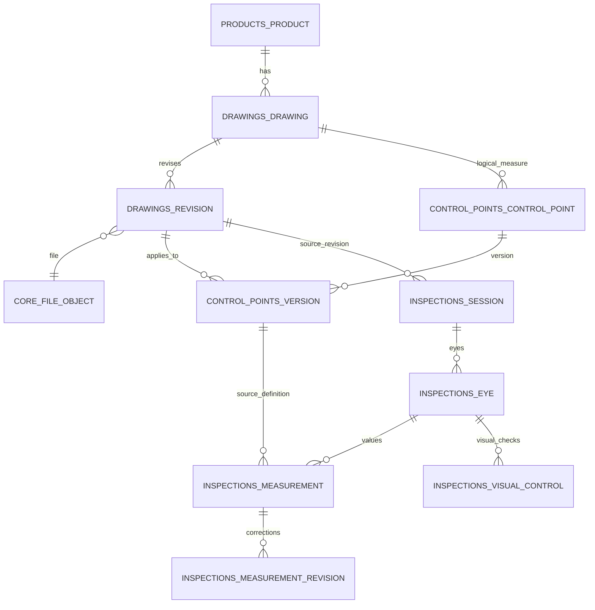
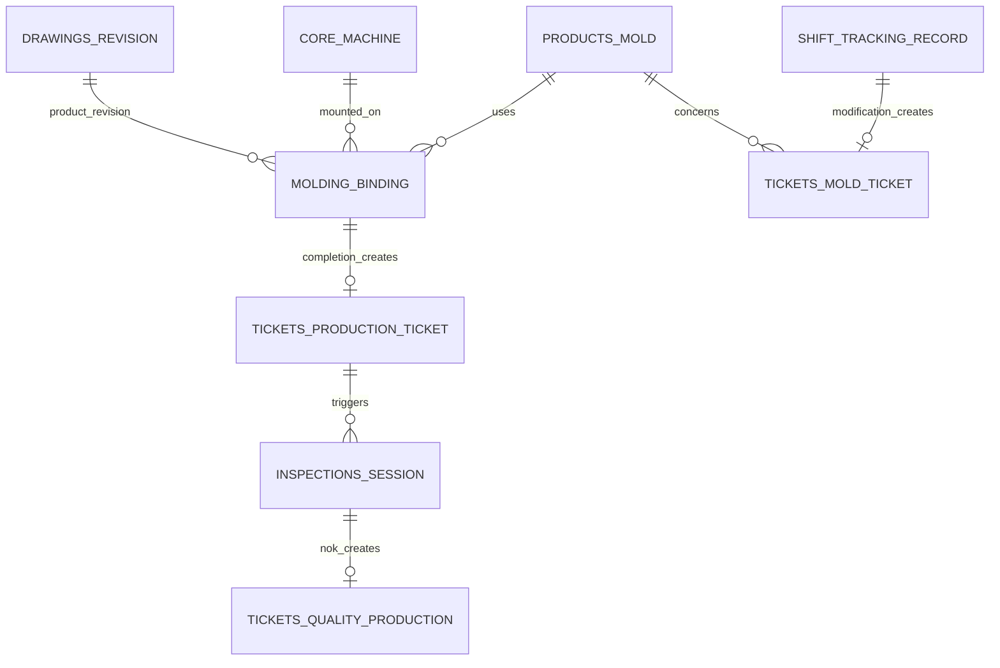
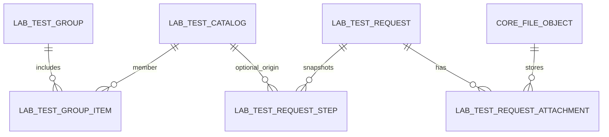
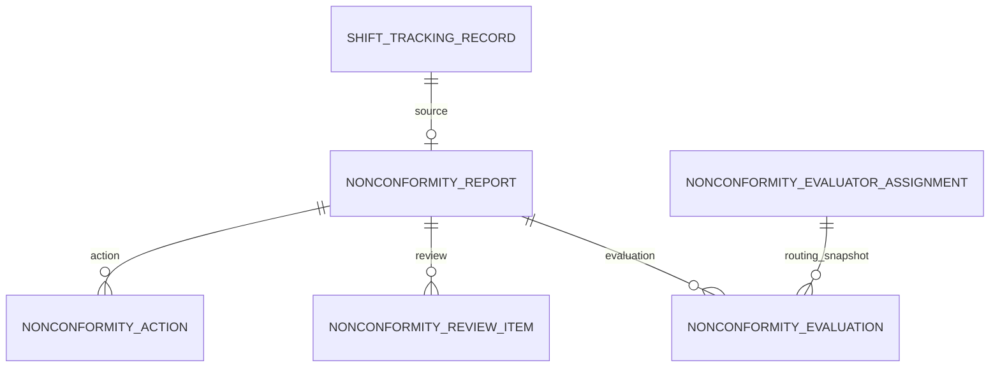
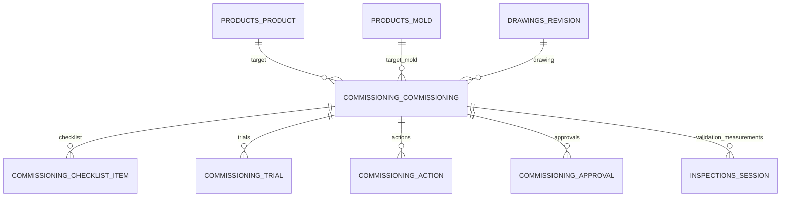

# A Blok Kalite Kontrol — PostgreSQL ERD v1

**Tarih:** 26.08.2026  
**Üst doküman:** `WEB_DONUSUM_MASTER_PLANI_V1.md`  
**İş kuralları:** `DOMAIN_RULES_V1.md`  
**Migration:** `LEGACY_MAPPING_V1.md`  
**Hedef:** Django + PostgreSQL için normalize, tarihsel bütünlüğü koruyan ve legacy migration’a uygun v1 veri modeli.

---

# 1. Tasarım yaklaşımı

Bu ERD mevcut `Schema.sql` dosyasının PostgreSQL’e çevrilmiş hali değildir. Yeni model şu prensiplere göre sıfırdan tasarlanmıştır:

- UUID primary key
- gerçek `boolean`, `numeric`, `integer`, `date`, `timestamptz`
- master data ile historical snapshot ayrımı
- immutable/revision history
- explicit state machine
- foreign key + unique/check constraint
- dosyanın DB dışında, metadata’nın DB’de tutulması
- migration için legacy key mapping
- audit ve notification’ın generic altyapı olması

## 1.1 PostgreSQL önerileri

- PostgreSQL 17+ veya deployment anındaki desteklenen güncel major
- `pgcrypto` yalnız gerektiğinde UUID/hash yardımcıları için; Django UUID üretimi yeterliyse zorunlu değil
- case-insensitive business key için ya normalize edilmiş ayrı kolon ya da `citext`
- `timestamptz` standardı
- UTC storage, `Europe/Istanbul` display
- Django migration’ları schema source of truth

---

# 2. Domain/app sınırları

```text
accounts
core
products
drawings
control_points
inspections
spc
metrology
molding
tickets
shift_tracking
nonconformity
mechanism
ino
laboratory
package_meter
commissioning
notifications
audit
legacy_migration
```

Fiziksel PostgreSQL schema ayırımı şart değildir. Django’nun tek `public` schema + app-prefixed table yapısı ilk sürüm için yeterlidir.

---

# 3. Üst seviye ERD

```mermaid
erDiagram
    ACCOUNTS_USER_PROFILE ||--o{ ACCOUNTS_USER_ROLE : has
    ACCOUNTS_ROLE ||--o{ ACCOUNTS_USER_ROLE : assigned
    ACCOUNTS_ROLE ||--o{ ACCOUNTS_ROLE_PERMISSION : grants
    ACCOUNTS_PERMISSION ||--o{ ACCOUNTS_ROLE_PERMISSION : contains

    PRODUCTS_PRODUCT ||--o{ PRODUCTS_PRODUCT_MOLD : uses
    PRODUCTS_MOLD ||--o{ PRODUCTS_PRODUCT_MOLD : belongs
    PRODUCTS_PRODUCT ||--o{ DRAWINGS_DRAWING : owns
    DRAWINGS_DRAWING ||--o{ DRAWINGS_REVISION : versions
    CORE_FILE_OBJECT ||--o| DRAWINGS_REVISION : stores

    DRAWINGS_DRAWING ||--o{ CONTROL_POINTS_CONTROL_POINT : defines
    CONTROL_POINTS_CONTROL_POINT ||--o{ CONTROL_POINTS_VERSION : versions
    DRAWINGS_REVISION ||--o{ CONTROL_POINTS_VERSION : effective_on
    DRAWINGS_REVISION ||--o{ CONTROL_POINTS_GROUP_AREA : groups

    DRAWINGS_REVISION ||--o{ INSPECTIONS_SESSION : inspected
    INSPECTIONS_SESSION ||--o{ INSPECTIONS_EYE : contains
    INSPECTIONS_EYE ||--o{ INSPECTIONS_MEASUREMENT : measures
    CONTROL_POINTS_VERSION ||--o{ INSPECTIONS_MEASUREMENT : snapshot_from
    METROLOGY_DEVICE ||--o{ INSPECTIONS_MEASUREMENT : measured_with
    INSPECTIONS_MEASUREMENT ||--o{ INSPECTIONS_MEASUREMENT_REVISION : corrected
    INSPECTIONS_EYE ||--o{ INSPECTIONS_VISUAL_CONTROL : visual

    PRODUCTS_MOLD ||--o{ MOLDING_BINDING : bound
    CORE_MACHINE ||--o{ MOLDING_BINDING : machine
    MOLDING_BINDING ||--o| TICKETS_PRODUCTION_TICKET : creates
    SHIFT_TRACKING_RECORD ||--o| TICKETS_MOLD_TICKET : may_create
    INSPECTIONS_SESSION ||--o| TICKETS_QUALITY_PRODUCTION : may_create

    SHIFT_TRACKING_RECORD ||--o{ SHIFT_TRACKING_PHOTO : has
    CORE_FILE_OBJECT ||--o{ SHIFT_TRACKING_PHOTO : stores
    SHIFT_TRACKING_RECORD ||--o| NONCONFORMITY_REPORT : source
    NONCONFORMITY_REPORT ||--o{ NONCONFORMITY_ACTION : actions
    NONCONFORMITY_REPORT ||--o{ NONCONFORMITY_REVIEW_ITEM : reviews
    NONCONFORMITY_REPORT ||--o{ NONCONFORMITY_EVALUATION : evaluated

    COMMISSIONING_COMMISSIONING ||--o{ COMMISSIONING_CHECKLIST_ITEM : checklist
    COMMISSIONING_COMMISSIONING ||--o{ COMMISSIONING_TRIAL : trials
    COMMISSIONING_COMMISSIONING ||--o{ COMMISSIONING_ACTION : actions
    COMMISSIONING_COMMISSIONING ||--o{ COMMISSIONING_APPROVAL : approvals
    COMMISSIONING_COMMISSIONING ||--o{ INSPECTIONS_SESSION : inspections

    LAB_TEST_REQUEST ||--o{ LAB_TEST_REQUEST_STEP : steps
    LAB_TEST_REQUEST ||--o{ LAB_TEST_REQUEST_ATTACHMENT : attachments
    CORE_FILE_OBJECT ||--o{ LAB_TEST_REQUEST_ATTACHMENT : stores
    LAB_TEST_CATALOG ||--o{ LAB_TEST_GROUP_ITEM : grouped
    LAB_TEST_GROUP ||--o{ LAB_TEST_GROUP_ITEM : contains

    PACKAGE_METER_CONTROL ||--o{ PACKAGE_METER_LINE : lines

    NOTIFICATION_RECIPIENT ||--o{ NOTIFICATION_EVENT : configured_for
    ACCOUNTS_USER_PROFILE ||--o{ AUDIT_EVENT : acts
```



Not: Generic notification event ile recipient arasında geçmiş alıcı snapshot’ı JSONB tutulabileceğinden gerçek relation her olay için zorunlu değildir; üst ERD kavramsal bağı gösterir.

---

# 4. Ortak veri tipleri / enumlar

Django `TextChoices` + PostgreSQL check constraint yaklaşımı önerilir. Native PostgreSQL ENUM kullanılabilir ancak migration esnekliği için ilk sürümde `varchar + CheckConstraint` daha kolaydır.

## DrawingScope

```text
PLASTIC
INCOMING_QUALITY
TR
```

## RevisionStatus

```text
DRAFT
ACTIVE
SUPERSEDED
WITHDRAWN
```

## InspectionStatus

```text
DRAFT
IN_PROGRESS
WAITING_VISUAL
COMPLETED
CANCELLED
```

## MeasurementResult

```text
OK
NOK
ERROR
```

## TicketStatus

```text
OPEN
SEEN
CLOSED
CANCELLED  -- yalnız destekleyen ticket tiplerinde
```

## BindingStatus

```text
STARTED
COMPLETED
CANCELLED  -- TO-BE opsiyonel
```

## TestRequestStatus

```text
OPEN
ACCEPTED
COMPLETED
CANCELLED
```

## TestStepStatus

```text
PENDING
COMPLETED
SKIPPED
```

## PackageControlStatus

```text
DRAFT
COMPLETED
```

## ShiftModule

```text
PLASTIC
MECHANISM
```

---

# 5. Accounts

## `accounts_user_profile`

Django `AUTH_USER_MODEL` ile one-to-one.

| Kolon | Tip | Null | Not |
|---|---|---:|---|
| id | uuid PK | no | |
| user_id | FK auth_user UNIQUE | no | Django identity |
| external_username | varchar(150) | yes | AD/OIDC login |
| display_name | varchar(250) | yes | |
| department_id | FK core_department | yes | |
| is_active | boolean | no | default true |
| is_permission_test_account | boolean | no | default false |
| legacy_created_at | timestamptz | yes | |
| legacy_last_login_at | timestamptz | yes | |
| created_at | timestamptz | no | |
| updated_at | timestamptz | no | |

Index:

- normalized/citext `external_username` unique when non-null.

## `accounts_role`

| id uuid PK | code varchar(80) UNIQUE | name varchar(150) | is_active bool |

Örnek code:

`ADMIN`, `MANAGER`, `TECHNICAL_DRAWING`, `QUALITY_MANAGER`, `PLASTIC_QC`, `INCOMING_QC`, `MECHANISM_QC`, `MECHANISM_MANAGER`, `LAB`, `PRODUCTION_USER`, `PRODUCTION_MANAGER`, `PRODUCTION_LABEL`, `PLANNING`.

## `accounts_permission`

| id | code UNIQUE | description |

Örnek: `drawing.view`, `drawing.manage`, `inspection.create`, `spc.correct`, `test.step.override`.

## `accounts_user_role`

| user_profile_id FK | role_id FK | granted_at | granted_by |

Unique `(user_profile_id, role_id)`.

## `accounts_role_permission`

Unique `(role_id, permission_id)`.

**Alternatif:** Django auth Group/Permission kullanılabilir. O durumda bu iki tablo Django built-in tablolarıyla değiştirilir; domain mantığı aynı kalır.

---

# 6. Core catalogs / files

## `core_department`

| id uuid | code varchar(80) UNIQUE | name varchar(150) | is_active bool |

## `core_machine`

| Kolon | Tip |
|---|---|
| id | uuid PK |
| machine_code | varchar(100) UNIQUE |
| machine_name | varchar(200) nullable |
| is_active | boolean |
| metadata | jsonb |

Legacy machine string’i bulunamazsa kayıt sırasında auto-create yerine controlled catalog import önerilir.

## `core_file_object`

| Kolon | Tip | Kural |
|---|---|---|
| id | uuid PK | |
| storage_backend | varchar(30) | FILESYSTEM/MINIO/S3 |
| storage_key | text UNIQUE | kullanıcıya gösterilmez |
| original_filename | varchar(500) | |
| mime_type | varchar(200) | |
| size_bytes | bigint | >=0 |
| sha256 | char(64) | index |
| encryption_key_version | varchar(50) nullable | application-level encryption varsa |
| uploaded_by_id | FK user nullable | |
| created_at | timestamptz | |
| legacy_source_path | text nullable | migration-only / restricted |

Index `(sha256, size_bytes)`.

---

# 7. Products / Mold

## `products_product`

| Kolon | Tip |
|---|---|
| id | uuid PK |
| name | varchar(300) |
| plastic_code | varchar(150) nullable |
| material_text | varchar(250) nullable |
| color_name | varchar(150) nullable |
| is_active | boolean default true |
| created_by_id | FK user nullable |
| created_at | timestamptz |
| updated_at | timestamptz |
| legacy_group_key | text nullable |

Index: normalized `plastic_code`, normalized `name`.

**Unique zorunlu değil.** Legacy data profiling tamamlanmadan product name/code üzerine sert global unique konmamalıdır.

## `products_mold`

| id uuid PK | mold_code varchar(150) UNIQUE | cavity_count integer nullable CHECK >0 | is_active boolean |

Normalize edilmiş mold code tutulur; ham multi-code string product relation metadata’da korunabilir.

## `products_product_mold`

| product_id FK | mold_id FK | cavity_count_override integer nullable | legacy_mold_code_text text nullable |

Unique `(product_id, mold_id)`.

---

# 8. Drawings

## `drawings_drawing`

| Kolon | Tip |
|---|---|
| id | uuid PK |
| product_id | FK products_product nullable |
| tr_code | varchar(150) |
| tr_code_normalized | varchar(150) |
| scope | varchar(30) |
| is_active | boolean |
| created_at | timestamptz |
| updated_at | timestamptz |

### Provisional unique

`UNIQUE(tr_code_normalized, scope)`.

Bu constraint final migration profiling sonrasında aktif edilmelidir. Aynı TR+scope gerçekten birden fazla product’a ait çıkarsa ADR ile identity değişir.

## `drawings_revision`

| Kolon | Tip |
|---|---|
| id | uuid PK |
| drawing_id | FK drawings_drawing |
| revision_code | varchar(100) |
| status | varchar(30) |
| file_id | FK core_file_object nullable |
| effective_from | timestamptz nullable |
| effective_to | timestamptz nullable |
| approved_by_id | FK user nullable |
| approved_at | timestamptz nullable |
| created_by_id | FK user nullable |
| created_at | timestamptz |
| legacy_is_active | boolean nullable |

Constraints:

- unique `(drawing_id, revision_code)`
- effective_to >= effective_from
- partial unique: `drawing_id WHERE status='ACTIVE'`

Recommended index: `(drawing_id, status)`.

---

# 9. Control points

## `control_points_control_point`

Mantıksal ölçüyü temsil eder.

| Kolon | Tip |
|---|---|
| id | uuid PK |
| drawing_id | FK drawings_drawing |
| spc_key | varchar(200) |
| logical_code | varchar(200) nullable |
| is_active | boolean |
| created_at | timestamptz |

Unique `(drawing_id, spc_key)`.

## `control_points_version`

| Kolon | Tip |
|---|---|
| id | uuid PK |
| control_point_id | FK control_points_control_point |
| drawing_revision_id | FK drawings_revision |
| version_no | integer CHECK >=1 |
| measure_code | varchar(200) |
| measure_name | varchar(500) |
| nominal | numeric(14,5) |
| lower_tolerance | numeric(14,5) |
| upper_tolerance | numeric(14,5) |
| lower_limit | numeric(14,5) |
| upper_limit | numeric(14,5) |
| unit | varchar(30) default 'mm' |
| page_no | integer CHECK >=1 |
| x_percent | numeric(7,4) |
| y_percent | numeric(7,4) |
| is_mandatory | boolean |
| measurement_group | varchar(150) |
| sample_frequency | varchar(150) |
| is_critical | boolean |
| sort_no | integer |
| valid_from | timestamptz nullable |
| valid_to | timestamptz nullable |
| change_reason | text nullable |
| is_active | boolean |
| created_by_id | FK user nullable |
| created_at | timestamptz |

Constraints:

- unique `(control_point_id, version_no)`
- unique `(drawing_revision_id, measure_code)` — aktif/veri profiline göre gerekirse partial
- `x_percent BETWEEN 0 AND 100`
- `y_percent BETWEEN 0 AND 100`
- `lower_limit <= nominal`
- `nominal <= upper_limit`
- `lower_tolerance <= 0`
- `upper_tolerance >= 0`
- valid_to >= valid_from

**Service validation:** limitler nominal/tolerans ile uyumlu olmalı.

## `control_points_group_area`

| drawing_revision_id FK | group_name varchar | page_no int | left_percent numeric | top_percent numeric | right_percent numeric | bottom_percent numeric | updated_by | updated_at |

Unique `(drawing_revision_id, group_name, page_no)`.

Checks:

- all percent 0..100
- right > left
- bottom > top

---

# 10. Inspection / Measurement

## `inspections_session`

| Kolon | Tip |
|---|---|
| id | uuid PK |
| drawing_revision_id | FK drawings_revision |
| scope | varchar(30) | snapshot/fast filter |
| status | varchar(30) |
| lot_no | varchar(200) nullable |
| serial_no | varchar(200) nullable |
| declared_eye_count | integer CHECK >=1 |
| operator_id | FK user nullable |
| operator_name_snapshot | varchar(250) |
| source_computer_name | varchar(250) nullable |
| production_ticket_id | FK tickets_production_ticket nullable |
| commissioning_id | FK commissioning nullable |
| started_at | timestamptz nullable |
| completed_at | timestamptz nullable |
| overall_result | varchar(30) nullable |
| legacy_record_id | varchar(150) nullable |
| created_at | timestamptz |
| updated_at | timestamptz |

Legacy migration için `legacy_record_id` unique **yalnız imported records** kapsamında olmalıdır. Aynı string farklı source setinde conflict olasılığı düşük olsa da key map source-aware kalır.

Indexes:

- `(drawing_revision_id, completed_at DESC)`
- `(lot_no)`
- `(serial_no)`
- `(commissioning_id)`

## `inspections_eye`

| id uuid PK | session_id FK | eye_no integer | is_closed boolean | closed_at timestamptz nullable | close_reason text nullable |

Unique `(session_id, eye_no)`.

Check: eye_no >= 1.

## `inspections_measurement`

| Kolon | Tip |
|---|---|
| id | uuid PK |
| eye_id | FK inspections_eye |
| control_point_version_id | FK control_points_version nullable |
| measurement_device_id | FK metrology_device nullable |
| measured_value | numeric(14,5) |
| result | varchar(20) |
| legacy_result | varchar(50) nullable |
| note | text nullable |
| measured_by_id | FK user nullable |
| measured_by_snapshot | varchar(250) nullable |
| measured_at | timestamptz |
| measure_code_snapshot | varchar(200) |
| measure_name_snapshot | varchar(500) |
| group_snapshot | varchar(150) |
| sample_frequency_snapshot | varchar(150) |
| is_critical_snapshot | boolean |
| sort_no_snapshot | integer |
| nominal_snapshot | numeric(14,5) |
| lower_limit_snapshot | numeric(14,5) |
| upper_limit_snapshot | numeric(14,5) |
| unit_snapshot | varchar(30) |
| page_no_snapshot | integer |
| x_percent_snapshot | numeric(7,4) |
| y_percent_snapshot | numeric(7,4) |
| spc_key_snapshot | varchar(200) |
| measure_version_snapshot | integer |
| created_at | timestamptz |

Constraint candidate:

- unique `(eye_id, measure_code_snapshot)` for a finalized eye; legacy data profile first.
- lower_limit_snapshot <= upper_limit_snapshot.

Indexes:

- `(spc_key_snapshot, measured_at DESC)`
- `(control_point_version_id, measured_at DESC)`
- `(result, measured_at DESC)`

Result DB trigger ile değil domain service ile hesaplanır; test edilir.

## `inspections_measurement_revision`

| Kolon | Tip |
|---|---|
| id | uuid PK |
| measurement_id | FK measurement |
| legacy_correction_id | varchar(150) nullable |
| old_value | numeric(14,5) |
| new_value | numeric(14,5) |
| old_result | varchar(20) |
| new_result | varchar(20) |
| reason | text |
| changed_by_id | FK user nullable |
| changed_by_snapshot | varchar(250) |
| changed_at | timestamptz |
| source_computer_name | varchar(250) nullable |

Append-only application rule.

## `inspections_visual_control`

| id uuid PK | eye_id FK | control_name varchar(300) | is_selected bool | result varchar(50) | note text | controlled_by_id FK nullable | controlled_by_snapshot varchar | controlled_at timestamptz |

Index `(eye_id)`.

---

# 11. SPC

## `spc_limit_correction`

| Kolon | Tip |
|---|---|
| id | uuid PK |
| drawing_revision_id | FK drawings_revision |
| control_point_id | FK logical CP nullable |
| spc_key | varchar(200) |
| date_from | timestamptz nullable |
| date_to | timestamptz nullable |
| old_limits_raw | text/jsonb nullable |
| new_nominal | numeric(14,5) |
| new_lower_limit | numeric(14,5) |
| new_upper_limit | numeric(14,5) |
| affected_rows | integer |
| result_changed_rows | integer |
| reason | varchar(500) |
| changed_by_id | FK user nullable |
| changed_by_snapshot | varchar(250) |
| changed_at | timestamptz |
| source_computer_name | varchar(250) nullable |

Checks:

- upper > lower
- nominal between limits
- date_to >= date_from
- counts >=0

---

# 12. Metrology

## `metrology_device`

| Kolon | Tip |
|---|---|
| id | uuid PK |
| device_code | varchar(150) UNIQUE |
| fixed_asset_no | varchar(150) nullable |
| device_name | varchar(300) |
| serial_no | varchar(200) nullable |
| brand | varchar(150) nullable |
| model | varchar(150) nullable |
| device_type | varchar(150) nullable |
| measurement_range | varchar(250) nullable |
| resolution_text | varchar(100) nullable |
| unit | varchar(50) nullable |
| location | varchar(250) nullable |
| reference_device_id | self FK nullable |
| reference_device_text | varchar(250) nullable |
| usage_status | varchar(80) nullable |
| registration_date | date nullable |
| note | text nullable |
| status | varchar(80) nullable |
| calibration_period_months | integer nullable CHECK >0 |
| calibration_date | date nullable |
| calibration_due_date | date nullable |
| calibration_organization | varchar(300) nullable |
| responsible | varchar(250) nullable |
| std_iso9001 | boolean |
| std_iso45001 | boolean |
| std_iso50001 | boolean |
| std_iso46001 | boolean |
| std_iso17020 | boolean |
| std_iso17025 | boolean |
| is_active | boolean |
| created_at/updated_at | timestamptz |

Check due >= calibration date where both non-null.

---

# 13. Mold Binding

## `molding_binding`

| Kolon | Tip |
|---|---|
| id | uuid PK |
| legacy_binding_id | varchar(150) UNIQUE nullable |
| status | varchar(30) |
| mold_id | FK products_mold nullable |
| legacy_mold_code_text | text nullable |
| drawing_revision_id | FK drawings_revision nullable |
| machine_id | FK core_machine nullable |
| machine_no_snapshot | varchar(150) |
| previous_machine_id | FK core_machine nullable |
| previous_machine_no_snapshot | varchar(150) nullable |
| product_name_snapshot | varchar(300) nullable |
| material_snapshot | varchar(250) nullable |
| color_snapshot | varchar(150) nullable |
| plastic_code_snapshot | varchar(150) nullable |
| raw_material | varchar(250) |
| work_order_no | varchar(200) nullable |
| binding_reason | varchar(100) |
| machine_change_reason | text nullable |
| start_note | text nullable |
| finish_note | text nullable |
| note | text nullable |
| started_at | timestamptz |
| started_by_id | FK user nullable |
| started_by_snapshot | varchar(250) |
| start_computer_name | varchar(250) nullable |
| completed_at | timestamptz nullable |
| completed_by_id | FK user nullable |
| completed_by_snapshot | varchar(250) nullable |
| completed_computer_name | varchar(250) nullable |
| duration_minutes | integer nullable |
| created_at | timestamptz |

Checks:

- completed_at >= started_at
- COMPLETED ise completed_at dolu
- duration >=0

### Pending TO-BE constraint

Onaylanırsa:

```sql
CREATE UNIQUE INDEX uq_one_started_binding_per_mold
ON molding_binding (mold_id)
WHERE status = 'STARTED' AND mold_id IS NOT NULL;
```

**Bu index AS-IS değildir; ADR sonrası aktif edilir.**

Machine change reason mandatory check de ADR sonrası service constraint olarak eklenir.

---

# 14. Tickets

## `tickets_production_ticket`

Legacy isim korunmuştur; binding sonrası kaliteye yönlenen ticket.

| Kolon | Tip |
|---|---|
| id | uuid PK |
| legacy_ticket_id | varchar(150) UNIQUE nullable |
| status | varchar(30) |
| binding_id | FK molding_binding nullable UNIQUE |
| drawing_revision_id | FK drawings_revision nullable |
| mold_id | FK mold nullable |
| machine_no_snapshot | varchar(150) nullable |
| previous_machine_no_snapshot | varchar(150) nullable |
| mold_code_snapshot | varchar(250) nullable |
| tr_code_snapshot | varchar(150) nullable |
| revision_snapshot | varchar(100) nullable |
| product_name_snapshot | varchar(300) nullable |
| material_snapshot | varchar(250) nullable |
| color_snapshot | varchar(150) nullable |
| plastic_code_snapshot | varchar(150) nullable |
| raw_material | varchar(250) nullable |
| work_order_no | varchar(200) nullable |
| note | text nullable |
| created_by_id/snapshot | FK + varchar |
| created_at | timestamptz |
| seen_by_id/snapshot | FK + varchar nullable |
| seen_at | timestamptz nullable |
| closed_by_id/snapshot | FK + varchar nullable |
| closed_at | timestamptz nullable |
| close_note | text nullable |
| binding_start_at/end_at | timestamptz nullable |
| binding_duration_minutes | integer nullable |
| binding_reason_snapshot | varchar(100) nullable |
| machine_change_reason_snapshot | text nullable |

## `tickets_quality_production`

| Kolon | Tip |
|---|---|
| id | uuid PK |
| legacy_ticket_id | varchar(150) UNIQUE nullable |
| status | varchar(30) |
| inspection_session_id | FK inspection session |
| source_production_ticket_id | FK production ticket nullable |
| source_type | varchar(100) |
| issue_summary | text |
| measurement_nok_count | integer |
| visual_nok_count | integer |
| created/seen/closed lifecycle | actor/time |
| snapshot TR/rev/product/lot/serial/eye | typed text |

Unique `(inspection_session_id)` for current legacy semantics.

## `tickets_mold_ticket`

| Kolon | Tip |
|---|---|
| id | uuid PK |
| legacy_mold_ticket_id | varchar(150) UNIQUE nullable |
| status | varchar(30) |
| mold_id | FK mold nullable |
| drawing_revision_id | FK drawing revision nullable |
| source_shift_record_id | FK shift record nullable |
| mold_code_snapshot | varchar(250) |
| tr_code_snapshot | varchar(150) nullable |
| revision_snapshot | varchar(100) nullable |
| product_name_snapshot | varchar(300) nullable |
| severity | varchar(80) nullable |
| problem_type | varchar(150) nullable |
| problem_description | text |
| action_plan | text nullable |
| lifecycle actor/time/note | fields |

Partial unique candidate on `source_shift_record_id` where not null, subject to legacy profiling.

---

# 15. Connection Plan

## `molding_connection_plan_import`

| id uuid | imported_at timestamptz | imported_by_id/snapshot | source_file | source_sheet | file_object_id nullable | created_at |

## `molding_connection_plan_row`

| Kolon | Tip |
|---|---|
| id | uuid PK |
| import_id | FK import |
| legacy_plan_id | varchar(150) nullable |
| source_row | integer nullable |
| machine_id | FK nullable |
| machine_name_snapshot | varchar |
| machine_no_snapshot | varchar |
| running_molds | text nullable |
| current_mold_no | varchar nullable |
| current_mold_rack_no | varchar nullable |
| current_plastic_code | varchar nullable |
| current_tr_code | varchar nullable |
| first_mold_no | varchar nullable |
| first_mold_rack_no | varchar nullable |
| first_plastic_code | varchar nullable |
| first_tr_code | varchar nullable |
| second_mold_no | varchar nullable |
| second_mold_rack_no | varchar nullable |
| second_plastic_code | varchar nullable |
| second_tr_code | varchar nullable |

Unique `(import_id, source_row)` if source row known.

---

# 16. Shift Tracking

## `shift_tracking_record`

| Kolon | Tip |
|---|---|
| id | uuid PK |
| module_type | varchar(20) PLASTIC/MECHANISM |
| legacy_record_id | varchar(150) |
| occurred_at | timestamptz |
| defective_quantity_text | varchar(100) |
| defective_quantity_numeric | numeric(14,3) nullable |
| responsible | varchar(250) |
| product_name_code | varchar(400) |
| problem | text |
| action_taken | text nullable |
| yellow_card | boolean |
| mold_modification | boolean |
| error_report_flag | boolean |
| test_performed | boolean |
| created_by_id/snapshot | FK + varchar |
| created_at | timestamptz |
| updated_by_id/snapshot | FK + varchar nullable |
| updated_at | timestamptz |
| source_computer_name | varchar(250) nullable |

Unique `(module_type, legacy_record_id)` for imported rows.

Indexes `(module_type, occurred_at DESC)`, product text trigram optional.

## `shift_tracking_photo`

| id uuid | shift_record_id FK | file_id FK | legacy_photo_id varchar nullable | original_filename_snapshot | added_by_id/snapshot | added_at | source_computer_name |

Unique `legacy_photo_id` nullable subject to source uniqueness.

---

# 17. Nonconformity / Error Report

## `nonconformity_report`

| Kolon | Tip |
|---|---|
| id | uuid PK |
| legacy_report_id | varchar(150) UNIQUE nullable |
| report_no | varchar(100) UNIQUE nullable |
| source_shift_record_id | FK shift record UNIQUE nullable |
| status | varchar(40) |
| revision_date | date/timestamptz nullable |
| source_department | varchar(200) nullable |
| quality_control_point | varchar(250) nullable |
| part_name_no | varchar(300) nullable |
| tr_no | varchar(150) nullable |
| part_type | varchar(150) nullable |
| quantity_text | varchar(100) nullable |
| machine_no | varchar(150) nullable |
| operator_name | varchar(250) nullable |
| defect_area | varchar(200) nullable |
| defect_code | varchar(100) nullable |
| defect_type | varchar(200) nullable |
| nonconformity_description | text |
| quality_inspector | varchar(250) nullable |
| detected_by | varchar(250) nullable |
| unit_manager_approval | varchar(100) nullable |
| disposition | text nullable |
| kaizen_responsible | varchar(250) nullable |
| kaizen_no | varchar(100) nullable |
| root_cause | text nullable |
| verification_due_date | date nullable |
| verification_activities | text nullable |
| verification_responsible | varchar(250) nullable |
| verification_date | date nullable |
| verification_suitable | boolean nullable |
| close_approved | boolean |
| close_note | text nullable |
| created/updated actor/time/computer | fields |

## `nonconformity_action`

| id uuid | report_id FK | legacy_slot_no int nullable | action_text text | responsible varchar | due_date date nullable | closed_date date nullable | status varchar nullable | created_at |

No 5-action limit.

## `nonconformity_review_item`

| id uuid | report_id FK | review_type varchar(60) | result varchar(100) nullable | detail text nullable |

Unique `(report_id, review_type)`.

Review types:

`STOCK`, `AFFECTED_PROCESS`, `AFFECTED_PRODUCT`, `DOCUMENT_NEED`, `DRAWING_REVISION`, `MOLD_REVISION`, `SEMI_FINISHED`.

## `nonconformity_evaluator_assignment`

Global assignment/current routing table:

| id | position_key UNIQUE | position_name | required_role_id FK | assigned_user_id FK nullable | assigned_username_snapshot | assigned_email | is_active | updated_by/at |

## `nonconformity_evaluation`

Historical snapshot:

| id uuid | legacy_evaluation_id varchar nullable | report_id FK | position_key | position_name_snapshot | required_role_snapshot | assigned_user_id nullable | assigned_username_snapshot | assigned_email_snapshot | decision | explanation | evaluated_by_id/snapshot | evaluated_at | updated_at | source_computer_name |

Unique `(report_id, position_key)`.

Decision check: `APPROVED`, `REVISION_REQUIRED`.

Service: REVISION_REQUIRED → explanation mandatory.

---

# 18. Mechanism Quality

## `mechanism_quality_delivery`

| Kolon | Tip |
|---|---|
| id | uuid PK |
| legacy_control_id | varchar(150) UNIQUE nullable |
| status | varchar(40) |
| created_at | timestamptz |
| control_datetime | timestamptz nullable |
| incoming_eye_count | integer CHECK >=1 |
| delivered_by_id | FK user nullable |
| delivered_by_snapshot | varchar(250) |
| product_id | FK product nullable |
| product_name_code_snapshot | varchar(400) |
| mounted_mechanism_counter | varchar(200) nullable |
| delivery_explanation | text nullable |
| control_explanation | text nullable |
| is_suitable | boolean nullable |
| controlled_by_id | FK user nullable |
| controlled_by_snapshot | varchar(250) nullable |
| controlled_at | timestamptz nullable |
| created_computer_name | varchar(250) nullable |
| controlled_computer_name | varchar(250) nullable |

Check: completed + unsuitable → control_explanation nonempty service-level; `is_suitable` nullable instead of dual booleans önerilir.

---

# 19. INO

## `ino_record`

| Kolon | Tip |
|---|---|
| id | uuid PK |
| legacy_sequence_no | varchar(100) nullable |
| meter_name | varchar(300) nullable |
| order_location | varchar(300) nullable |
| work_order_no | varchar(200) nullable |
| ino1_department | varchar(200) nullable |
| ino1_approval_date | timestamptz/date nullable |
| ino1_approved_by | varchar(250) nullable |
| ino1_report_no | varchar(150) nullable |
| ino1_status | varchar(100) nullable |
| ino2_approval_date | timestamptz/date nullable |
| ino2_approved_by | varchar(250) nullable |
| ino2_report_no | varchar(150) nullable |
| q4 | numeric(14,5) nullable |
| q3 | numeric(14,5) nullable |
| intermediate_flow | numeric(14,5) nullable |
| q2 | numeric(14,5) nullable |
| q1 | numeric(14,5) nullable |
| tam_positive | numeric(14,5) nullable |
| tam_negative | numeric(14,5) nullable |
| ino2_status | varchar(100) nullable |
| explanation | text nullable |
| request_date | date/timestamptz nullable |
| source_row_hash | char(64) nullable |
| created_at/updated_at | timestamptz |

Unique on legacy_sequence_no only after profiling; blank/duplicates possible.

Field-level permission service/policy layer, not per-column DB grants.

---

# 20. Laboratory

## `laboratory_test_catalog`

| id uuid | name varchar(300) | name_normalized varchar(300) UNIQUE | description text nullable | is_active bool | sort_no int | created/updated actor/time |

## `laboratory_test_group`

| id uuid | name varchar(300) UNIQUE | is_active bool | sort_no int | legacy_tests_text text nullable | audit |

## `laboratory_test_group_item`

| group_id FK | test_id FK | sort_no integer |

Unique `(group_id, test_id)` and `(group_id, sort_no)`.

## `laboratory_test_request`

| Kolon | Tip |
|---|---|
| id | uuid PK |
| legacy_request_id | varchar(150) UNIQUE nullable |
| status | varchar(30) |
| requesting_department_id | FK core_department nullable |
| requesting_department_snapshot | varchar(200) |
| requested_department_id | FK nullable |
| requested_department_snapshot | varchar(200) |
| reason_summary | text |
| product_id | FK product nullable |
| drawing_id/revision_id | FK nullable |
| product_tr_snapshot | varchar(500) |
| requested_tests_legacy_text | text nullable |
| sample_quantity | integer nullable |
| sample_quantity_legacy_text | varchar(100) nullable |
| priority | varchar(50) nullable |
| due_date | date nullable |
| requester_report_no | varchar(150) nullable |
| requester_explanation | text nullable |
| lab_report_no | varchar(150) nullable |
| result | varchar(100) nullable |
| lab_explanation | text nullable |
| created_by_id/snapshot | FK + varchar |
| created_at | timestamptz |
| accepted_by_id/snapshot | FK + varchar nullable |
| accepted_at | timestamptz nullable |
| completed_by_id/snapshot | FK + varchar nullable |
| completed_at | timestamptz nullable |
| cancelled_by_id/snapshot | FK + varchar nullable |
| cancelled_at | timestamptz nullable |
| cancel_reason | text nullable |
| updated_by_id/snapshot | FK + varchar nullable |
| updated_at | timestamptz |
| created_computer_name | varchar(250) nullable |

Lifecycle checks service + DB where straightforward.

## `laboratory_test_request_step`

| Kolon | Tip |
|---|---|
| id | uuid PK |
| request_id | FK test_request |
| legacy_step_id | varchar(150) nullable |
| sort_no | integer CHECK >=1 |
| catalog_test_id | FK test_catalog nullable |
| test_name_snapshot | varchar(300) |
| test_description_snapshot | text nullable |
| status | varchar(30) |
| result | varchar(100) nullable |
| explanation | text nullable |
| completed_by_id/snapshot | fields nullable |
| completed_at | timestamptz nullable |
| completed_computer_name | varchar nullable |
| skipped_by_id/snapshot | fields nullable |
| skipped_at | timestamptz nullable |
| skip_reason | text nullable |
| reopened_by_id/snapshot | fields nullable |
| reopened_at | timestamptz nullable |
| reopen_reason | text nullable |
| created/updated actor/time | fields |

Constraints:

- unique `(request_id, sort_no)`
- unique `(request_id, legacy_step_id)` where legacy_step_id not null

Strict ordering remains service rule because cross-row state checks require transaction logic.

## `laboratory_test_request_attachment`

| id uuid | request_id FK | file_id FK | legacy_attachment_id varchar nullable | original_filename_snapshot | added_by_id/snapshot | added_at | source_computer_name |

---

# 21. Package Meter

## `package_meter_control`

| Kolon | Tip |
|---|---|
| id | uuid PK |
| legacy_control_id | varchar(150) UNIQUE nullable |
| status | varchar(30) |
| meter_model | varchar(250) |
| pulse_count | integer/numeric |
| customer | varchar(300) |
| control_date | date/timestamptz |
| operator_info | varchar(300) |
| controller_name | varchar(300) |
| production_panel_no | varchar(150) |
| control_panel_no | varchar(150) |
| is_smart_meter | boolean |
| reference_flow_q4 | numeric(14,5) |
| reference_flow_q3 | numeric(14,5) |
| reference_flow_q2 | numeric(14,5) |
| reference_flow_q1 | numeric(14,5) |
| range_value | integer |
| explanation | text nullable |
| meter_count | integer default 0 |
| suitable_count | integer default 0 |
| unsuitable_count | integer default 0 |
| incomplete_count | integer default 0 |
| lifecycle actor/time/computer | fields |

Check range_value IN `(40,50,63,80,100,125,160,200,250,315,400,500,630,800,1000)`.

## `package_meter_line`

| Kolon | Tip |
|---|---|
| id | uuid PK |
| control_id | FK package_meter_control |
| legacy_line_id | varchar(150) nullable |
| sort_no | integer |
| serial_number | varchar(200) |
| label_error_q3 | numeric(14,5) nullable |
| label_error_q2 | numeric(14,5) nullable |
| label_error_q1 | numeric(14,5) nullable |
| test_flow_q4_manual | numeric(14,5) nullable |
| test_flow_q3 | numeric(14,5) nullable |
| test_flow_q2 | numeric(14,5) nullable |
| test_flow_q1 | numeric(14,5) nullable |
| credit_result | varchar(80) nullable |
| valve_result | varchar(80) nullable |
| overall_result | varchar(40) |
| created/updated actor/time | fields |

Constraints:

- unique `(control_id, sort_no)`
- unique `(control_id, serial_number)`
- max 500 rows is service-level + count lock check

---

# 22. Commissioning

## `commissioning_commissioning`

| Kolon | Tip |
|---|---|
| id | uuid PK |
| legacy_commissioning_id | varchar(150) UNIQUE nullable |
| status | varchar(30) |
| current_stage | varchar(50) |
| legacy_current_stage | varchar(100) nullable |
| product_id | FK product nullable |
| drawing_revision_id | FK drawing revision nullable |
| mold_id | FK mold nullable |
| product_name_snapshot | varchar(300) |
| product_code_snapshot | varchar(200) |
| drawing_no_snapshot | varchar(150) |
| drawing_rev_snapshot | varchar(100) |
| mold_code_snapshot | varchar(150) |
| mold_manufacturer | varchar(300) nullable |
| cavity_count | integer nullable |
| raw_material | varchar(250) nullable |
| color | varchar(150) nullable |
| masterbatch | varchar(200) nullable |
| planned_machine_id | FK machine nullable |
| planned_machine_snapshot | varchar(150) nullable |
| target_cycle_seconds | numeric(12,3) nullable |
| planned_quantity | integer nullable |
| critical_dimensions | text nullable |
| special_characteristics | text nullable |
| function_tests | text nullable |
| mating_parts | text nullable |
| customer_requirements | text nullable |
| requested_production_date | date nullable |
| participating_departments | text nullable |
| documents_note | text nullable |
| final_decision | varchar(40) nullable |
| final_decision_note | text nullable |
| conditional_until | date nullable |
| conditional_quantity | integer/varchar nullable |
| next_trial_date | date nullable |
| created/updated actor/time | fields |

`current_stage` domain service tarafından türetilir.

## `commissioning_approval`

| id uuid | commissioning_id FK | approval_type varchar(30) | decision varchar(40) | decided_by_id/snapshot | decided_at |

Unique `(commissioning_id, approval_type)`.

Approval type: `MECHANICAL`, `PRODUCT`, `PROCESS`.

Final decision ayrı parent alanında tutulur. İleride FINAL child approval’a dönüştürülebilir.

## `commissioning_checklist_item`

| id uuid | commissioning_id FK | legacy_checklist_id varchar nullable | item_no int | category varchar | item_text text | result varchar | explanation text | checked_by_id/snapshot | checked_at |

Unique `(commissioning_id, item_no)` if legacy data confirms.

## `commissioning_trial`

| Kolon | Tip |
|---|---|
| id | uuid PK |
| commissioning_id | FK |
| legacy_trial_id | varchar(150) nullable |
| trial_no | varchar/int |
| trial_date | date/timestamptz nullable |
| machine_id/snapshot | FK + varchar |
| material_lot | varchar nullable |
| process_status | varchar |
| sample_per_cavity | integer/text nullable |
| cycle_time | numeric nullable |
| part_weight | numeric nullable |
| runner_weight | numeric nullable |
| visual_result | varchar nullable |
| function_result | varchar nullable |
| measurement_result | varchar nullable |
| quality_validation_result | varchar nullable |
| nonconformity | text nullable |
| created/updated actor/time | fields |

## `commissioning_action`

| id uuid | commissioning_id FK | trial_id FK nullable | legacy_action_id varchar nullable | legacy_trial_no varchar nullable | severity varchar | cavity_no varchar nullable | description text | probable_cause text nullable | responsible_department varchar nullable | action_text text | due_date date nullable | status varchar | verification_note text nullable | created/updated actor/time |

No fixed number limit.

---

# 23. Notifications

## `notifications_recipient`

| Kolon | Tip |
|---|---|
| id | uuid PK |
| module | varchar(80) |
| event_type | varchar(100) nullable |
| requesting_department | varchar(200) nullable |
| email | varchar(320) |
| display_name | varchar(250) nullable |
| recipient_type | varchar(30) nullable |
| is_active | boolean |
| legacy_source | varchar(200) nullable |
| created/updated actor/time | fields |

Unique candidate `(module,event_type,requesting_department,email,recipient_type)` after null-normalization.

## `notifications_event`

| Kolon | Tip |
|---|---|
| id | uuid PK |
| event_key | varchar(250) UNIQUE |
| module | varchar(80) |
| event_type | varchar(100) |
| entity_type | varchar(100) nullable |
| entity_id | uuid nullable |
| entity_legacy_key | varchar(150) nullable |
| recipients_snapshot | jsonb |
| subject_snapshot | text nullable |
| delivery_status | varchar(40) |
| sent_at | timestamptz nullable |
| sent_by_id | FK user nullable |
| sent_by_snapshot | varchar(250) nullable |
| source_computer_name | varchar(250) nullable |
| error_detail | text nullable |
| created_at | timestamptz |

Recipient FK yerine recipients snapshot historical doğruluk için esastır.

---

# 24. Audit

## `audit_event`

| Kolon | Tip |
|---|---|
| id | uuid PK |
| occurred_at | timestamptz |
| actor_user_id | FK user nullable |
| actor_username_snapshot | varchar(250) nullable |
| actor_role_snapshot | varchar(200) nullable |
| source_computer_name | varchar(250) nullable |
| ip_address | inet nullable |
| user_agent | text nullable |
| action | varchar(200) |
| entity_type | varchar(100) nullable |
| entity_id | uuid nullable |
| entity_key_snapshot | varchar(300) nullable |
| before_data | jsonb nullable |
| after_data | jsonb nullable |
| detail | text nullable |
| source | varchar(20) | WEB/LEGACY |
| legacy_log_id | varchar(150) nullable |
| correlation_id | uuid nullable |

Indexes:

- `(occurred_at DESC)`
- `(actor_user_id, occurred_at DESC)`
- `(entity_type, entity_id, occurred_at DESC)`
- GIN on before/after only if operational need; default not necessary.

Audit append-only application permission.

---

# 25. Legacy migration support

## `legacy_import_run`

As defined in `LEGACY_MAPPING_V1.md`.

## `legacy_key_map`

Source → target UUID map.

Suggested columns:

```text
id uuid PK
import_run_id uuid FK
source_name varchar(250)
source_key varchar(500)
target_table varchar(250)
target_id uuid
row_hash char(64)
created_at timestamptz
```

Unique `(source_name, source_key, target_table)`.

## `legacy_reject`

```text
id uuid PK
import_run_id uuid FK
source_name varchar(250)
source_row_number bigint nullable
source_key varchar(500) nullable
raw_data jsonb
reason_code varchar(100)
reason_detail text
severity varchar(20)
resolved_at timestamptz nullable
resolved_by_id FK user nullable
resolution_note text nullable
```

Index `(import_run_id, severity, source_name)`.

---

# 26. Kritik ilişki ERD — Engineering + Inspection



### Neden ControlPoint / Version ayrıldı?

Çünkü legacy `SpcKey` mantıksal ölçüyü sabit tutarken MeasureId/version değişebiliyor. SPC trendi logical control point üzerinden, tarihsel measurement ise exact version snapshot üzerinden izlenmelidir.

---

# 27. Kritik ilişki ERD — Molding / Ticket



---

# 28. Kritik ilişki ERD — Laboratory



Step satırındaki test name/description **snapshot**’tır; catalog FK silinse/değişse bile tarihsel talep okunabilir.

---

# 29. Kritik ilişki ERD — Error Report



Assignment current routing’dir; evaluation assignment snapshot’ı ayrıca kendi satırında tutulur.

---

# 30. Kritik ilişki ERD — Commissioning



---

# 31. Constraint matrisi

| Constraint | Katman | v1 |
|---|---|---|
| Drawing revision unique | DB unique | Zorunlu |
| Tek ACTIVE revision/drawing | Partial unique | Zorunlu |
| CP logical SPC key unique/drawing | DB unique | Zorunlu |
| CP version no unique | DB unique | Zorunlu |
| CP coordinate 0..100 | CHECK | Zorunlu |
| CP lower<=nominal<=upper | CHECK | Zorunlu |
| Eye no unique/session | DB unique | Zorunlu |
| Quality→Production one/session | DB unique | Legacy semantik için zorunlu |
| Test step sort unique/request | DB unique | Zorunlu |
| Test strict next-step order | Service + transaction | Zorunlu |
| Package serial unique/control | DB unique | Zorunlu |
| Package max 500 line | Service + row lock | Zorunlu |
| One report/source shift | DB unique | Legacy profiling sonrası |
| One STARTED binding/mold | Partial unique | **ADR bekliyor** |
| Machine-change reason | Service/conditional check | **ADR bekliyor** |
| Drawing `(TR,scope)` unique | DB unique | **Data profiling gate** |

---

# 32. İndeksleme planı

## Measurement/SPC

```text
inspections_measurement(spc_key_snapshot, measured_at DESC)
inspections_measurement(result, measured_at DESC)
inspections_session(drawing_revision_id, completed_at DESC)
inspections_session(lot_no)
inspections_session(serial_no)
```

Büyük hacimde ileride BRIN index `measured_at` için değerlendirilebilir.

## Tickets

```text
tickets_* (status, created_at DESC)
molding_binding(status, started_at DESC)
molding_binding(mold_id, status)
```

## Shift/NCR

```text
shift_tracking_record(module_type, occurred_at DESC)
nonconformity_report(status, created_at DESC)
nonconformity_evaluation(report_id, position_key)
```

## Lab

```text
laboratory_test_request(status, created_at DESC)
laboratory_test_request(requested_department_id, status)
laboratory_test_request_step(request_id, sort_no)
```

## File

```text
core_file_object(sha256, size_bytes)
```

Text search ihtiyacında PostgreSQL trigram (`pg_trgm`) ikinci fazda kullanılabilir; ilk günden her text alana GIN koymayın.

---

# 33. Concurrency / transaction tasarımı

## Drawing activation

```text
transaction.atomic
  lock drawing
  supersede old ACTIVE
  activate requested revision
commit
```

Partial unique son güvenlik katmanıdır.

## Binding completion

```text
transaction.atomic
  select_for_update(binding)
  assert STARTED
  mark COMPLETED
  create/get idempotent production ticket
commit
```

## Inspection finalize

```text
transaction.atomic
  lock session/eyes
  validate mandatory measurements
  compute all results server-side
  require visual completion
  derive overall result
  get_or_create NOK ticket if needed
  optionally close linked production ticket
  mark COMPLETED
commit
```

Taslak değerlerin ara autosave’i bu final transaction’dan ayrı olabilir.

## Test step transition

```text
transaction.atomic
  lock request + all ordered steps
  assert request status
  calculate next pending/last resolved
  apply complete/skip/reopen
commit
```

## Package finalize

Control row lock + lines validation + count update + status change tek transaction.

---

# 34. Historical snapshot ilkesi

Aşağıdaki alanların FK’nin yanında snapshot tutulmasının nedeni master verinin zaman içinde değişebilmesidir:

- measurement name/code/nominal/limits/SPC version
- ticket TR/revision/product/mold/machine
- actor username/display name
- laboratory test name/description
- evaluation assigned user/email/required role
- notification recipients

**Kural:** Historical report render edilirken mümkün olduğunca snapshot tercih edilir; current master değerleri geçmiş olayı yeniden yazmamalıdır.

---

# 35. Soft-delete / immutability matrisi

| Entity | Delete yaklaşımı |
|---|---|
| Product | deactivate |
| Mold | deactivate |
| Drawing | deactivate |
| Drawing revision | supersede/withdraw |
| Logical control point | deactivate |
| CP version | immutable/passive |
| Inspection completed | delete yok; correction/cancel policy |
| Measurement | delete yok; correction revision |
| Measurement revision | append-only |
| SPC correction | append-only |
| Completed binding | delete yok normal flow |
| Ticket | state history, Admin delete gerekiyorsa audit + policy |
| Shift record | legacy permissions var; web’de soft delete önerilir |
| NCR | closed immutable except managed reopen |
| Test completed | immutable except controlled correction/reopen if designed |
| Package completed | correction/reopen önerilir |
| Audit event | append-only |
| Notification event | append-only |

---

# 36. Django app dependency yönü

Circular dependency azaltmak için öneri:

```text
accounts ─┐
core ─────┼─────────────┐
products ─┤             │
drawings ─┤             │
control_points ─┤       │
metrology ──────┤       │
commissioning ──┤       │
inspections ────┤       │
shift_tracking ─┤       │
nonconformity ──┤       │
molding ────────┤       │
tickets ────────┤       │
laboratory ─────┤       │
package_meter ──┤       │
notifications ──┤       │
audit ──────────┘       │
legacy_migration ────────┘
```

Pratikte tickets ↔ inspections ↔ molding arasında FK döngüsü oluşabilir. Bunu azaltmak için:

- bazı optional relation’ları `SET_NULL`,
- state transition service’lerini app service katmanında,
- notification/audit’i generic entity reference veya signal değil explicit service çağrısıyla

tasarlayın.

---

# 37. Foreign key delete davranışı

Genel öneri:

- historical child → master: `PROTECT` veya `RESTRICT`
- snapshot olan optional reference: `SET_NULL`
- gerçek child collection: parent silinemiyorsa `CASCADE` teknik olarak olabilir, fakat application parent delete’i zaten engeller
- file object: referanslıysa `PROTECT`; orphan cleanup ayrı job

Örnek:

- Measurement → ControlPointVersion: `SET_NULL` kabul edilebilir çünkü snapshot var, ama normal UI version delete etmez.
- Session → DrawingRevision: `PROTECT`.
- DrawingRevision → File: `PROTECT/SET_NULL` migration issue durumuna göre; normal complete revision file gerektirir.
- TestStep → CatalogTest: `SET_NULL` çünkü snapshot var.

---

# 38. Data retention ve audit düşüncesi

Bu v1 ERD retention sürelerini sabitlemez. Fakat DB tasarımı şu ayrımı desteklemelidir:

- transactional quality history — uzun süreli
- audit — politika süresince
- generated reports/cache — yeniden üretilebilir
- notifications — belirli retention
- files — drawing revision ve request retention’a bağlı
- legacy staging/raw — cutover + doğrulama süresi sonunda ayrı archive/purge policy

`legacy_source_path` gibi hassas iç yol alanları normal uygulama kullanıcılarına hiçbir endpoint ile açılmamalıdır.

---

# 39. İlk Django migration setine girmesi gereken tablolar

WP-001/002/003/004 başlangıcı için önce:

1. accounts_user_profile/role/permission
2. core_department/machine/file_object
3. products_product/mold/product_mold
4. drawings_drawing/revision
5. control_points_control_point/version/group_area
6. audit_event
7. legacy_import_run/key_map/reject

İkinci migration wave:

8. commissioning
9. metrology
10. inspections
11. molding/tickets

Üçüncü wave:

12. shifts/nonconformity/mechanism/ino
13. laboratory
14. package meter
15. notification

Bu sıra migration scriptlerinin FK çözümünü kolaylaştırır.

---

# 40. ERD v1 için açık kararlar

Bu şema aşağıdaki noktalarda bilinçli olarak “karar bekliyor” durumundadır:

## ADR-001 — Drawing identity

Önerilen `(TR code normalized, scope)` unique. Final constraint yalnız actual CSV profiling sonrası.

## ADR-002 — Tek aktif mold binding

Constraint örneği hazır fakat mevcut masaüstü davranışından farklıdır. İş onayı olmadan migration/code’a hard rule olarak alınmamalı.

## ADR-003 — Machine change reason

Column nullable bırakılmıştır. TO-BE onaylanırsa conditional service validation eklenir.

## ADR-004 — Commissioning ŞARTLI ONAY

Parent final_decision bu değeri destekler fakat status completion AS-IS gereği yalnız ONAYLANDI ile tamamlanır. Yeni terminal state kararı sonraki ADR.

## ADR-005 — SPC historical corrections

ERD correction event’i saklar. Yeni sistem eski measurement snapshot’ını fiziksel update mi edecek, analytical override mı uygulayacak ayrıca kararlaştırılmalı.

## ADR-006 — Package completed edit

ERD correction/reopen tablosu henüz eklemiyor. Admin direct-edit yerine correction akışı seçilirse `package_meter_revision` eklenmeli.

---

# 41. Codex için modelleme kuralları

1. Para/ölçüm decimal değerlerinde `FloatField` kullanma; `DecimalField`.
2. `DateTimeField` timezone-aware.
3. Her modelde indiscriminately `JSONField` kullanma; typed field öncelikli.
4. Legacy `NVARCHAR` alanlarını olduğu gibi TextField’a dökme.
5. Enum/string normalize fonksiyonları migration katmanında merkezi olsun.
6. `clean()` yalnız destek validation; critical business transition service’te.
7. DB constraints mümkün olan invariant’ları korusun.
8. Historical snapshot alanlarını kaldırıp yalnız FK bırakma.
9. Audit signal’larıyla her save’e kör audit üretme; explicit domain event tercih et.
10. Bulk import signals’ına güvenme.
11. File binary PostgreSQL `bytea` içine konmasın.
12. PasswordHash/Salt modeli yaratma.
13. Session/process heartbeat legacy tablolarını yeniden kurma.
14. Her pending ADR model comment/ADR referansıyla işaretlensin.

---

# 42. Örnek Django constraint taslakları

Bunlar doğrudan copy-paste nihai kod değildir; intent gösterir.

```python
models.UniqueConstraint(
    fields=["drawing"],
    condition=Q(status="ACTIVE"),
    name="uq_active_revision_per_drawing",
)
```

```python
models.CheckConstraint(
    condition=Q(x_percent__gte=0) & Q(x_percent__lte=100),
    name="cp_x_percent_0_100",
)
```

```python
models.CheckConstraint(
    condition=Q(lower_limit__lte=F("nominal")) & Q(nominal__lte=F("upper_limit")),
    name="cp_nominal_between_limits",
)
```

Pending ADR:

```python
models.UniqueConstraint(
    fields=["mold"],
    condition=Q(status="STARTED") & Q(mold__isnull=False),
    name="uq_started_binding_per_mold",
)
```

Son constraint **ADR-002 onayı olmadan eklenmemelidir.**

---

# 43. v1 tamlık kontrolü

ERD aşağıdaki legacy domainleri kapsar:

- kullanıcı/rol/yetki
- ürün/kalıp
- teknik resim/revizyon/dosya
- kontrol noktası/version/group area
- measurement/visual/closed eye/correction
- SPC correction
- MSA/device
- binding/connection plan
- üç ticket tipi
- commissioning
- plastic/mechanism shift + photo
- error report/action/review/evaluator/evaluation
- mechanism quality
- INO
- test request/catalog/group/step/attachment
- package meter
- recipients/email event generic notification
- audit
- legacy migration metadata

Migrate edilmeyen legacy teknik veriler:

- ActiveSessions
- SessionEndRequests
- RunningInstances
- MeasurementDrafts
- updater/version deployment files
- file locks
- pending transaction journal after recovery

Bunlar bilerek ERD dışında bırakılmıştır.

---

## Sonuç

ERD v1’in merkezindeki üç karar şunlardır:

1. **Drawing → Revision → ControlPoint logical → ControlPointVersion** ayrımı sayesinde teknik resim ve ölçü revizyon geçmişi kaybolmaz.
2. **InspectionSession → Eye → Measurement snapshot** sayesinde hem gelecekte gerçek çok-gözlü web oturumları desteklenir hem de legacy `RecordId` güvenli biçimde taşınır.
3. Ticket, test, commissioning ve uygunsuzluk süreçleri serbest CSV satırları değil, explicit state ve ilişkilerle yönetilir.

Bu şema Codex’in Django model/migration üretmeye başlaması için yeterli v1 temeldir; ancak `DOMAIN_RULES_V1.md` içindeki `DECISION/TO-BE` maddeleri onaylanmadan ilgili hard constraint’ler uygulanmamalıdır.
